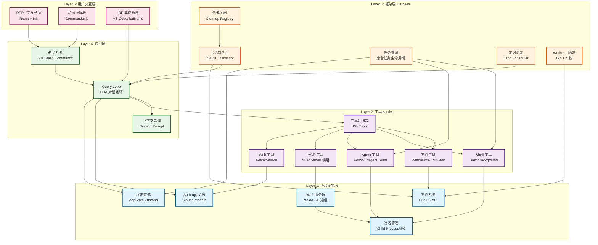

# 00 - 架构总览

> **摘要**
>
> 本章提供 Claude Code CLI 的全局视角，涵盖系统的核心架构、设计决策和技术栈。通过 5 层架构模型和关键实现细节，帮助读者快速建立对整个系统的认知框架。
>
> **关键概念:** 五层架构、Tool System、Query Loop、Harness Framework、状态持久化
>
> **前置知识:** TypeScript 基础、Node.js 运行时、终端基础知识
>
> **源码位置:** `src/`

---

## 第 1 节：概述

### 1.1 Claude Code 是什么？

**Claude Code CLI** 是 Anthropic 官方开发的命令行界面工具，它让开发者能够直接在终端中与 Claude AI 协作完成软件工程任务——包括代码编写、文件操作、命令执行、代码库搜索、Git 工作流管理等。

这不是一个简单的聊天界面包装。Claude Code CLI 是一个完整的 **AI 辅助编程环境**，具备以下核心特性:

- **工具驱动架构**: 43+ 内置工具,涵盖文件操作、Shell 执行、代码搜索、Web 访问等
- **长时间运行能力**: 支持后台任务、定时调度、会话恢复、崩溃恢复
- **多 Agent 协作**: 支持派生子 Agent、团队协作、任务委派
- **可扩展性**: MCP (Model Context Protocol) 协议支持、插件系统、Skill 系统
- **终端原生体验**: 基于 React/Ink 的终端 UI、Vim 模式、键盘导航

从规模上看，这是一个工程级项目:
- **代码量**: ~1,900 个文件，512,000+ 行 TypeScript 代码
- **运行时**: Bun (高性能 JavaScript/TypeScript 运行时)
- **UI 框架**: React + Ink (React for CLI)
- **架构复杂度**: 多层架构，涵盖状态管理、进程通信、持久化、调度等

### 1.2 为什么它很特殊？

Claude Code CLI 在 AI 编程工具领域独树一帜，主要因为它需要解决以下 5 个独特挑战:

#### 挑战 1: 终端 UI 的实时交互

与 Web 界面不同，终端 UI 需要:
- **低延迟渲染**: 60 FPS 的流畅体验（16ms 帧时间）
- **复杂输入处理**: 键盘快捷键、鼠标事件、焦点管理
- **优雅降级**: 兼容不同终端模拟器（iTerm2、Windows Terminal、tmux）
- **状态同步**: React 虚拟 DOM 与终端 ANSI 序列的同步

**解决方案**: 使用 React + Ink 框架，通过声明式 UI 管理复杂的终端渲染逻辑。

#### 挑战 2: 长时间运行任务的可靠性

AI 工作流可能持续几分钟甚至几小时:
- **崩溃恢复**: 任何时候进程中断，用户都能无损恢复
- **状态持久化**: 对话历史、任务状态、文件修改记录必须实时保存
- **后台任务管理**: 编译、测试等任务在后台运行，完成后通知用户

**解决方案**: 设计 **Harness Framework**（任务执行框架层），采用 JSONL 增量日志、文件锁协调、优雅关闭机制。

#### 挑战 3: 多 Agent 协作

复杂任务需要分解给多个 AI Agent 并行处理:
- **进程隔离**: 每个子 Agent 在独立进程中运行，避免状态污染
- **通信机制**: 主 Agent 与子 Agent 之间的消息传递、权限委派
- **资源管理**: 控制并发 Agent 数量，避免 API 速率限制

**解决方案**: 使用 `AgentTool` 派生子进程，通过 stdio + IPC 通信，实现层级化的 Agent 协作。

#### 挑战 4: 状态持久化和崩溃恢复

状态管理复杂度极高:
- **会话状态**: 对话历史、上下文、文件修改历史
- **任务状态**: 后台任务进度、定时任务、MCP 连接状态
- **配置状态**: 用户设置、权限记录、插件配置

**解决方案**: 采用 **JSONL (JSON Lines)** 格式的增量日志，所有状态变更追加写入磁盘，支持快速尾部读取和崩溃恢复。

#### 挑战 5: 工具权限管理

AI 调用工具可能带来风险（如删除文件、执行命令）:
- **细粒度权限**: 每个工具调用都需要权限检查
- **用户体验平衡**: 避免过度打扰用户，支持自动批准模式
- **审计追踪**: 记录所有工具调用历史，支持回溯

**解决方案**: 设计 **Permission System**，支持多种模式（`default`、`plan`、`auto`、`bypassPermissions`），并集成拒绝追踪（Denial Tracking）机制。

### 1.3 在 AI 工具生态中的位置

对比其他主流 AI 编程工具:

| 工具 | 定位 | 特点 | 局限性 |
|------|------|------|--------|
| **GitHub Copilot** | IDE 插件 | 代码补全、内联建议 | 单次操作，无长期任务 |
| **Cursor** | AI-first IDE | 集成编辑器、聊天界面 | 绑定特定 IDE |
| **Aider** | CLI 工具 | 命令行交互、Git 集成 | 功能相对简单 |
| **Claude Code CLI** | 终端原生环境 | 长时间任务、多 Agent、可扩展 | 学习曲线较陡 |

**Claude Code 的独特定位**:
- **CLI-first**: 终端是第一优先级，而非 Web/IDE 的附属品
- **Agent-centric**: 以 AI Agent 为中心的工作流，而非简单的代码补全
- **Infrastructure-level**: 提供了完整的基础设施（会话管理、任务调度、进程隔离），而非单一功能工具

---

## 第 2 节：设计目标与约束

### 2.1 设计目标

1. **可靠性优先**: 任何崩溃都能无损恢复，状态持久化是核心要求
2. **性能体验**: 启动时间 < 2 秒，UI 渲染 60 FPS，工具调用低延迟
3. **开发者友好**: 终端原生体验，支持 Vim 模式、键盘导航、快捷键
4. **可扩展性**: 插件系统、MCP 协议、Skill 系统，支持第三方扩展
5. **可观测性**: 清晰的日志、实时状态监控、错误追踪

### 2.2 技术约束

1. **运行时限制**: 必须支持 Bun（性能）和 Node.js（兼容性）
2. **离线能力**: 核心功能应支持离线使用（除 AI 推理）
3. **跨平台**: macOS、Linux、Windows（WSL）全支持
4. **资源控制**: 单个会话内存 < 500MB，CPU 使用 < 50%
5. **安全边界**: 工具执行必须经过权限检查，不能绕过沙箱

### 2.3 非目标（Explicitly Out of Scope）

1. **图形界面**: 不提供 Electron 或 Web UI（有独立的桌面应用）
2. **模型训练**: 不涉及模型微调或本地训练
3. **代码仓库托管**: 不是 GitHub/GitLab 的替代品
4. **项目管理**: 不是 Jira/Linear 的替代品

---

## 第 3 节：核心架构

### 3.1 整体架构图

Claude Code CLI 采用 **五层架构** (5-Layer Architecture)，自下而上分别是:



**图表说明**:
- 图表位于 `/assets/diagrams/architecture-overview.mmd`
- 可使用 Mermaid Live Editor 查看: https://mermaid.live

**层级职责**:

| 层级 | 名称 | 职责 | 核心组件 |
|------|------|------|----------|
| Layer 5 | 用户交互层 | 处理用户输入输出，终端 UI 渲染 | REPL、CLI Parser、Bridge |
| Layer 4 | 应用层 | 业务逻辑，命令处理，LLM 对话循环 | Commands、QueryLoop、Context |
| Layer 3 | 框架层 | 长时间运行支撑，任务管理，持久化 | Session、TaskMgr、Cron、Graceful Shutdown |
| Layer 2 | 工具执行层 | 工具注册与执行，权限检查 | Tools、FileTools、ShellTools、AgentTools |
| Layer 1 | 基础设施层 | 系统调用，文件 I/O，进程管理，网络通信 | FileSystem、Process、MCP、API、State |

### 3.2 核心概念

#### 3.2.1 Tool（工具）

**Tool** 是 Claude Code 的基本执行单元。每个工具对应一个 AI 可以调用的能力。

```typescript
// 工具定义（精简版）
type Tool = {
  name: string                          // 工具名称（如 "Read"）
  description: string                   // 功能描述
  input_schema: ToolInputJSONSchema     // 输入参数 JSON Schema
  execute: (input: any, context: ToolUseContext) => Promise<ToolResult>
  permission?: ToolPermission           // 权限配置
}

// 工具结果
type ToolResult = {
  type: 'text' | 'image' | 'error'
  text?: string
  content?: ContentBlock[]
  is_error?: boolean
}
```

**示例工具**: `Read` 工具

```typescript
{
  name: "Read",
  description: "读取文件内容，支持文本、图片、PDF、Jupyter Notebook",
  input_schema: {
    type: "object",
    properties: {
      file_path: { type: "string", description: "文件绝对路径" },
      limit: { type: "number", description: "读取行数限制" },
      offset: { type: "number", description: "起始行号" }
    },
    required: ["file_path"]
  }
}
```

#### 3.2.2 Query Loop（查询循环）

**Query Loop** 是 AI 对话的核心驱动循环，负责:
1. 接收用户消息
2. 调用 Anthropic API 获取 AI 响应
3. 处理 AI 返回的工具调用 (tool_use)
4. 执行工具并返回结果 (tool_result)
5. 继续循环直到 AI 完成任务

```typescript
// Query Loop 简化伪码
async function queryLoop(userMessage: string): Promise<void> {
  const messages: Message[] = [{ role: 'user', content: userMessage }]

  while (true) {
    // 1. 调用 Anthropic API
    const response = await anthropicAPI.messages.create({
      model: 'claude-sonnet-4',
      messages,
      tools: getAvailableTools()
    })

    // 2. 处理响应
    if (response.stop_reason === 'end_turn') {
      // AI 完成任务
      break
    }

    if (response.stop_reason === 'tool_use') {
      // 3. 执行工具
      for (const toolUse of response.content.filter(c => c.type === 'tool_use')) {
        const result = await executeTool(toolUse.name, toolUse.input)
        messages.push({
          role: 'user',
          content: [{ type: 'tool_result', tool_use_id: toolUse.id, content: result }]
        })
      }
      // 4. 继续循环
      continue
    }
  }
}
```

#### 3.2.3 Task（任务）

**Task** 代表一个长时间运行的后台操作（如 Shell 命令、子 Agent）。

```typescript
// 任务状态联合类型
type TaskState =
  | LocalShellTaskState      // Bash 命令
  | LocalAgentTaskState      // 子 Agent
  | RemoteAgentTaskState     // 远程 Agent
  | InProcessTeammateTaskState // 多 Agent 协作
  | DreamTaskState           // 长期后台任务
  | MonitorMcpTaskState      // MCP 监控

// 基础任务接口
interface BaseTaskState {
  id: string
  type: string
  status: 'pending' | 'running' | 'completed' | 'failed' | 'killed'
  description: string
  startTime: number
  endTime?: number
  notified: boolean         // 是否已通知用户完成
}
```

### 3.3 数据流示例

**场景**: 用户要求读取文件 `README.md`

```
[用户] "读取 README.md"
    ↓
[REPL] 捕获输入 → 发送到 Query Loop
    ↓
[Query Loop] 构造消息 → 调用 Anthropic API
    ↓
[Anthropic API] 返回 tool_use: { name: "Read", input: { file_path: "README.md" } }
    ↓
[Query Loop] 提取 tool_use → 调用 Tool Executor
    ↓
[Tool Executor] 权限检查 → 执行 Read Tool
    ↓
[Read Tool] 调用 fs.readFile → 返回文件内容
    ↓
[Query Loop] 包装为 tool_result → 再次调用 API
    ↓
[Anthropic API] 返回文本响应（总结文件内容）
    ↓
[REPL] 渲染 AI 响应 → 显示给用户
```

---

## 第 4 节：关键实现

### 4.1 启动流程

**文件**: `src/main.tsx`

```typescript
// 启动流程（精简）
async function main() {
  // 1. 并行预取（优化启动时间）
  startMdmRawRead()           // 读取 MDM 设置（macOS）
  startKeychainPrefetch()     // 预取 Keychain 凭证

  // 2. 初始化 CLI 解析器
  const program = new Command()
    .name('claude')
    .description('Claude Code CLI')
    .version(getVersion())

  // 3. 注册命令
  program
    .command('chat')
    .description('Start a conversation')
    .action(async () => {
      await startREPL()
    })

  // 4. 设置优雅关闭
  setupGracefulShutdown()

  // 5. 启动后台维护
  startBackgroundHousekeeping()

  // 6. 解析参数并执行
  await program.parseAsync(process.argv)
}
```

**性能优化策略**:
- **并行预取**: MDM 读取和 Keychain 访问并行执行（节省 ~500ms）
- **懒加载**: 重模块（OpenTelemetry ~400KB、gRPC ~700KB）延迟到首次使用时加载
- **Feature Flags**: 使用 Bun 的 `bun:bundle` 特性标志，在构建时剔除未启用功能的代码

### 4.2 Tool 执行循环

**文件**: `src/QueryEngine.ts`

```typescript
// Tool 执行循环（精简）
async function executeToolUse(
  toolUse: ToolUseBlock,
  context: ToolUseContext
): Promise<ToolResult> {
  const tool = findTool(toolUse.name)
  if (!tool) {
    return { type: 'error', text: `Unknown tool: ${toolUse.name}` }
  }

  // 1. 权限检查
  const permission = await checkToolPermission(tool, toolUse.input, context)
  if (permission.denied) {
    return { type: 'error', text: 'Permission denied', is_error: true }
  }

  // 2. 输入验证
  const validation = validateToolInput(tool.input_schema, toolUse.input)
  if (!validation.result) {
    return { type: 'error', text: validation.message, is_error: true }
  }

  // 3. 执行工具
  try {
    const result = await tool.execute(toolUse.input, context)
    return result
  } catch (error) {
    return {
      type: 'error',
      text: `Tool execution failed: ${error.message}`,
      is_error: true
    }
  }
}
```

### 4.3 状态持久化

**文件**: `src/utils/sessionStorage.ts`

```typescript
// 会话存储（精简）
export async function appendToTranscript(
  sessionId: string,
  message: Message
): Promise<void> {
  const transcriptPath = getTranscriptPath(sessionId)
  const line = JSON.stringify(message) + '\n'

  // 原子追加写入（不需要读取整个文件）
  await fs.appendFile(transcriptPath, line, 'utf8')
}

// 快速恢复（只读最近消息）
export async function loadRecentMessages(
  sessionId: string,
  limit: number = 50
): Promise<Message[]> {
  const transcriptPath = getTranscriptPath(sessionId)

  // 读取文件末尾（避免加载完整历史）
  const tail = readFileTailSync(transcriptPath, 100 * 1024)  // 100KB

  // 解析 JSONL
  const lines = tail.split('\n').filter(Boolean)
  const messages = lines.map(line => JSON.parse(line))

  return messages.slice(-limit)
}
```

**JSONL 格式示例**:

```jsonl
{"role":"user","content":"读取 README.md","timestamp":1711891200000}
{"role":"assistant","content":[{"type":"tool_use","id":"toolu_123","name":"Read","input":{"file_path":"README.md"}}]}
{"role":"user","content":[{"type":"tool_result","tool_use_id":"toolu_123","content":"# Claude Code\n\n..."}]}
{"role":"assistant","content":"根据 README.md，这是 Claude Code CLI 的源码仓库..."}
```

---

## 第 5 节：设计权衡

### 5.1 为什么选择 Bun？

**替代方案对比**:

| 运行时 | 优点 | 缺点 |
|--------|------|------|
| **Node.js** | 生态成熟、兼容性最好 | 启动慢、内存占用高 |
| **Deno** | 安全沙箱、TypeScript 原生支持 | 生态不成熟、npm 兼容性差 |
| **Bun** | 启动快（3x）、性能高、兼容 Node.js | 相对较新、某些边缘场景有 bug |

**选择 Bun 的理由**:
1. **启动性能**: Bun 启动时间比 Node.js 快 3 倍（~200ms vs ~600ms）
2. **运行时性能**: HTTP 请求、文件 I/O 比 Node.js 快 2-4 倍
3. **内置功能**: 原生支持 TypeScript、JSX、.env 文件，无需额外工具链
4. **Node.js 兼容**: 99% 的 npm 包都能正常工作
5. **Feature Flags**: `bun:bundle` 支持编译期代码剔除（减少包体积）

**权衡**:
- ❌ 某些原生模块可能不兼容（如 `sharp`）
- ❌ Bun 的 bug 修复周期比 Node.js 慢
- ✅ 实际使用中，性能提升显著，兼容性问题可控

### 5.2 为什么选择 React/Ink？

**替代方案对比**:

| 方案 | 优点 | 缺点 |
|------|------|------|
| **原生 ANSI 序列** | 性能最高、完全控制 | 复杂度极高、难以维护 |
| **blessed/neo-blessed** | 功能丰富、文档完善 | 基于回调、状态管理混乱 |
| **React/Ink** | 声明式 UI、状态管理清晰 | 性能略低、学习曲线陡 |

**选择 React/Ink 的理由**:
1. **声明式 UI**: 用 JSX 描述终端界面，比命令式 ANSI 序列清晰 10 倍
2. **状态管理**: React Hooks + Zustand，避免全局状态混乱
3. **可测试性**: 组件可单独测试，无需模拟终端环境
4. **生态复用**: React 开发者零学习成本

**权衡**:
- ❌ 渲染性能略低于原生 ANSI（但 60 FPS 足够流畅）
- ❌ Bundle 体积较大（~2MB）
- ✅ 开发效率提升 5 倍以上，值得 trade-off

### 5.3 为什么选择子进程模型？

**替代方案对比**:

| 方案 | 优点 | 缺点 |
|------|------|------|
| **单进程多线程** | 共享内存、通信快 | JavaScript 无真正多线程、状态污染风险高 |
| **Worker Threads** | 线程隔离、共享内存 | Node.js Worker API 复杂、调试困难 |
| **子进程 (fork)** | 完全隔离、崩溃不影响主进程 | 通信开销大、内存占用高 |

**选择子进程的理由**:
1. **故障隔离**: 子 Agent 崩溃不影响主进程和其他 Agent
2. **资源控制**: 可以限制子进程的 CPU、内存、超时
3. **状态隔离**: 每个子 Agent 有独立的会话状态，避免污染
4. **调试友好**: 可以单独 attach 调试器到子进程

**权衡**:
- ❌ 进程启动开销 ~100ms（但可接受）
- ❌ 通信需要序列化（JSON/Protobuf）
- ✅ 可靠性提升显著，值得性能 trade-off

---

## 第 6 节：技术栈

### 6.1 核心技术

| 类别 | 技术 | 版本 | 用途 |
|------|------|------|------|
| **运行时** | Bun | 1.x | JavaScript/TypeScript 执行环境 |
| **语言** | TypeScript | 5.x | 类型安全、IDE 支持 |
| **UI 框架** | React | 18.x | 声明式 UI 组件 |
| **终端渲染** | Ink | 5.x | React for CLI |
| **CLI 解析** | Commander.js | 12.x | 命令行参数解析 |
| **Schema 验证** | Zod | 4.x | 输入参数验证 |
| **状态管理** | Zustand | 4.x | 全局状态管理 |
| **代码搜索** | ripgrep | 14.x | 高性能文本搜索 |

### 6.2 协议与集成

| 协议/集成 | 用途 | 实现位置 |
|-----------|------|----------|
| **MCP (Model Context Protocol)** | 外部工具集成 | `src/services/mcp/` |
| **LSP (Language Server Protocol)** | 代码智能提示 | `src/services/lsp/` |
| **Anthropic API** | Claude 模型调用 | `src/services/api/` |
| **OAuth 2.0** | 用户认证 | `src/services/oauth/` |
| **OpenTelemetry** | 遥测数据采集 | `src/utils/telemetry/` |

### 6.3 依赖管理策略

**依赖分类**:
1. **核心依赖** (必须): `@anthropic-ai/sdk`, `react`, `ink`, `commander`
2. **可选依赖** (Feature Flags): `@opentelemetry/*`, `grpc`, `voice-recognition`
3. **开发依赖**: `typescript`, `prettier`, `eslint`, `vitest`

**优化策略**:
- **Bundle Splitting**: 核心包 (~2MB)，可选功能按需加载
- **Tree Shaking**: 使用 Bun 的 Dead Code Elimination
- **Dynamic Import**: 重模块（如 OpenTelemetry）延迟加载

**版本锁定**:
- 所有依赖使用精确版本（`1.2.3`，不用 `^1.2.3`）
- 每周自动检查依赖更新（Dependabot）
- 重大更新需要完整回归测试

---

## 第 7 节：总结

### 7.1 核心要点回顾

1. **五层架构**: 从基础设施到用户交互，每层职责清晰
2. **Tool-driven**: 工具是核心抽象，所有能力通过工具暴露
3. **Harness Framework**: 长时间运行能力的关键（会话、任务、定时、关闭）
4. **状态持久化**: JSONL 增量日志，支持崩溃恢复
5. **进程隔离**: 子 Agent 在独立进程，故障不传播
6. **性能优化**: 并行预取、懒加载、批量操作、缓存策略

### 7.2 关键数据

| 指标 | 值 | 说明 |
|------|-----|------|
| 代码规模 | 512,000+ 行 | TypeScript |
| 文件数量 | 1,900+ | 模块化设计 |
| 工具数量 | 43+ | 内置工具 |
| 命令数量 | 50+ | Slash Commands |
| 启动时间 | < 2 秒 | 冷启动（含预取） |
| 会话恢复 | < 500ms | 只加载最近消息 |

## 第 6 节:与其他系统的关联

### 6.1 推荐阅读路径

作为架构总览，本章是了解整个系统的起点。根据你的兴趣方向，推荐以下阅读路径:

#### 路径 1: 工具系统深入
- [04-tool-system.md](./04-tool-system.md): 深入理解工具系统的实现细节
  - 工具接口定义、权限检查机制、工具分类体系
  - 了解 AI 如何通过工具与环境交互

#### 路径 2: 对话引擎核心
- [06-query-engine.md](./06-query-engine.md): 理解 AI 对话循环的核心机制
  - Query Loop 流程、Tool Call 自动触发、流式响应处理
  - 这是整个系统的心脏

#### 路径 3: 状态管理
- [07-state-management.md](./07-state-management.md): 学习全局状态如何管理
  - AppState 结构、Immutable 更新模式、React 集成
  - 理解系统如何维护一致的状态

#### 路径 4: 任务框架
- [08-task-framework.md](./08-task-framework.md): 了解长时间运行任务的管理
  - 后台任务生命周期、输出增量读取、任务持久化
  - 这是支撑 CLI 长时间运行能力的关键

### 6.2 完整学习路径建议

**入门路径** (理解核心概念):
```
00-overview → 04-tool-system → 06-query-engine
```
从全局视角开始，了解工具系统，最后深入对话引擎。

**进阶路径** (掌握关键系统):
```
00-overview → 07-state-management → 08-task-framework
```
理解状态管理和任务框架，掌握系统的可靠性基础。

**完整路径** (全面了解架构):
```
00-overview → 04-tool-system → 06-query-engine →
07-state-management → 08-task-framework
```
按照依赖关系循序渐进，建立完整的知识体系。

### 6.3 核心系统关系图

```
               ┌────────────────────┐
               │   00-overview      │
               │   (架构总览)        │
               └─────────┬──────────┘
                         │
         ┌───────────────┼───────────────┐
         │               │               │
         ▼               ▼               ▼
┌────────────────┐ ┌──────────────┐ ┌──────────────┐
│ 04-tool-system │ │ 06-query-    │ │ 07-state-    │
│ (工具系统)      │ │ engine       │ │ management   │
│                │ │ (查询引擎)    │ │ (状态管理)    │
└────────────────┘ └──────────────┘ └──────────────┘
                         │               │
                         └───────┬───────┘
                                 ▼
                    ┌──────────────────┐
                    │ 08-task-         │
                    │ framework        │
                    │ (任务框架)        │
                    └──────────────────┘
```

**依赖关系说明**:
- 所有系统都基于本章描述的五层架构
- 工具系统、查询引擎、状态管理是三个核心支柱
- 任务框架依赖状态管理和查询引擎，提供长时间运行能力

---

## 第 7 节:总结

### 7.1 核心要点回顾

1. **五层架构**: 从基础设施到用户交互，每层职责清晰
2. **Tool-driven**: 工具是核心抽象，所有能力通过工具暴露
3. **Harness Framework**: 长时间运行能力的关键（会话、任务、定时、关闭）
4. **状态持久化**: JSONL 增量日志，支持崩溃恢复
5. **进程隔离**: 子 Agent 在独立进程，故障不传播
6. **性能优化**: 并行预取、懒加载、批量操作、缓存策略

### 7.2 关键数据

| 指标 | 值 | 说明 |
|------|-----|------|
| 代码规模 | 512,000+ 行 | TypeScript |
| 文件数量 | 1,900+ | 模块化设计 |
| 工具数量 | 43+ | 内置工具 |
| 命令数量 | 50+ | Slash Commands |
| 启动时间 | < 2 秒 | 冷启动（含预取） |
| 会话恢复 | < 500ms | 只加载最近消息 |

### 7.3 后续阅读指引

完成本章后，你应该已经建立了对 Claude Code CLI 整体架构的认知框架。接下来推荐按照以下顺序深入学习:

1. **首先阅读**: [04-tool-system.md](./04-tool-system.md) - 理解工具系统是如何让 AI 与环境交互的
2. **然后阅读**: [06-query-engine.md](./06-query-engine.md) - 掌握对话循环的核心机制
3. **继续阅读**: [07-state-management.md](./07-state-management.md) - 了解全局状态管理
4. **最后阅读**: [08-task-framework.md](./08-task-framework.md) - 学习长时间任务管理

通过这个顺序，你将从理论到实践，从抽象到具体，全面掌握 Claude Code CLI 的核心架构。

---

**章节信息**
- **难度**: ⭐ 入门
- **字数**: ~4,200
- **预计阅读时间**: 15-20 分钟
- **最后更新**: 2026-03-31
- **维护者**: Claude Code 架构分析团队
