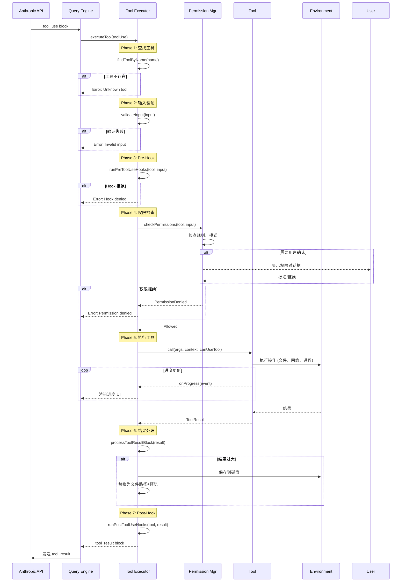

# 04 - Tool 工具系统

> **摘要**
>
> 本章深入解析 Claude Code CLI 的 Tool 工具系统架构。Tool 是 Claude 与外部环境交互的唯一接口,也是整个系统的核心抽象。通过 43+ 内置工具,Claude 可以完成文件操作、命令执行、代码搜索、Agent 协作等复杂任务。本章将剖析 Tool 的设计理念、架构模式、执行生命周期以及关键实现细节。
>
> **关键概念:** Tool 接口、执行生命周期、权限检查、工具分类、buildTool 构建器
>
> **前置知识:** TypeScript 基础、JSON Schema、00-overview.md (架构总览)
>
> **源码位置:** `src/Tool.ts`, `src/tools/`, `src/services/tools/`

---

## 第 1 节:概述

### 1.1 Tool 是什么?

**Tool** 是 Claude Code CLI 中 AI 与外部环境交互的基本执行单元。每个 Tool 封装了一个具体的能力,例如:
- **Read Tool**: 读取文件内容(支持文本、图片、PDF、Jupyter Notebook)
- **Bash Tool**: 执行 Shell 命令
- **Agent Tool**: 派生子 Agent 处理复杂任务
- **Grep Tool**: 高性能代码搜索

从概念上看,Tool 类似于函数调用(Function Calling),但包含了更多领域特定的逻辑:
- **输入验证**: 基于 JSON Schema 的参数校验
- **权限管理**: 细粒度的权限检查和用户确认
- **执行反馈**: 实时进度更新和结果流式传输
- **UI 渲染**: 终端 UI 的定制化展示

### 1.2 为什么需要 Tool 系统?

在 AI 辅助编程场景中,Tool 系统解决了以下核心问题:

#### 1.2.1 统一抽象层

AI 模型本身只能生成文本,无法直接操作文件系统、执行命令或访问网络。Tool 系统提供了统一的抽象层,让 AI 能够:
- **声明式描述意图**: 通过结构化的 JSON 输入描述要做什么
- **获得执行结果**: 接收结构化的 JSON 输出,供后续决策使用
- **隔离复杂性**: AI 无需了解底层实现细节(文件系统 API、进程管理、网络协议)

#### 1.2.2 安全边界

直接让 AI 执行任意代码存在极大风险。Tool 系统通过以下机制建立安全边界:
- **输入约束**: JSON Schema 限制参数类型和范围
- **权限检查**: 每个工具调用都经过权限系统审核
- **沙箱隔离**: 高危操作(如 Bash)可在沙箱中执行
- **审计追踪**: 所有工具调用被记录到会话日志

#### 1.2.3 可扩展性

Tool 系统是开放的,支持多种扩展方式:
- **内置工具**: 43+ 核心工具覆盖常见需求
- **MCP 工具**: 通过 MCP (Model Context Protocol) 协议集成外部工具
- **Skill 工具**: 用户自定义 Markdown 技能脚本
- **LSP 工具**: 集成 Language Server Protocol 提供代码智能

### 1.3 在架构中的位置

回顾架构总览中的五层架构,Tool 系统位于 **Layer 2: 工具执行层**:

```
┌───────────────────────────────────────────────────┐
│ Layer 4: 应用层                                    │
│   QueryLoop (查询循环)                             │
└───────────────────┬───────────────────────────────┘
                    │ 调用工具
                    ↓
┌───────────────────────────────────────────────────┐
│ Layer 2: 工具执行层                                │
│   ┌─────────────────────────────────────────────┐ │
│   │ Tool 注册表 (43+ Tools)                     │ │
│   │  ├─ 文件工具: Read, Write, Edit, Glob      │ │
│   │  ├─ Shell 工具: Bash, PowerShell           │ │
│   │  ├─ Agent 工具: Agent, TeamCreate          │ │
│   │  ├─ MCP 工具: MCPTool, ReadMcpResource     │ │
│   │  └─ Web 工具: WebFetch, WebSearch          │ │
│   └─────────────────────────────────────────────┘ │
│   ┌─────────────────────────────────────────────┐ │
│   │ 工具执行引擎                                │ │
│   │  ├─ 输入验证 (Zod Schema)                  │ │
│   │  ├─ 权限检查 (Permission System)            │ │
│   │  ├─ 执行协调 (StreamingToolExecutor)       │ │
│   │  └─ 结果处理 (Tool Result Storage)         │ │
│   └─────────────────────────────────────────────┘ │
└───────────────────┬───────────────────────────────┘
                    │ 依赖
                    ↓
┌───────────────────────────────────────────────────┐
│ Layer 1: 基础设施层                                │
│   FileSystem, Process, Network, State             │
└───────────────────────────────────────────────────┘
```

**数据流示例**:

1. **用户请求** → "读取 README.md 文件"
2. **QueryLoop** → 调用 Anthropic API,AI 返回 `tool_use: Read`
3. **工具执行引擎** → 提取 `tool_use` 块,查找 `Read` 工具
4. **输入验证** → 校验 `file_path` 参数是否符合 Schema
5. **权限检查** → 检查是否允许读取该路径
6. **执行工具** → `Read.call()` 读取文件内容
7. **返回结果** → 包装为 `tool_result`,发送回 QueryLoop
8. **AI 响应** → 基于文件内容生成用户可读的回复

---

## 第 2 节:设计目标与约束

### 2.1 设计目标

Tool 系统的设计围绕以下 5 个核心目标:

#### 目标 1: 类型安全

**要求**: 工具输入输出必须有明确的类型定义,在编译时和运行时都能捕获错误。

**实现**:
- 使用 **Zod v4** 定义 `inputSchema`,提供运行时类型检查
- TypeScript 泛型 `Tool<Input, Output>` 保证类型推断
- `z.infer<Input>` 自动推导 TypeScript 类型

**示例**:
```typescript
// 定义输入 Schema
const inputSchema = z.object({
  file_path: z.string().describe('文件绝对路径'),
  limit: z.number().optional().describe('读取行数限制')
})

// 自动推导 TypeScript 类型
type Input = z.infer<typeof inputSchema>
// => { file_path: string; limit?: number }
```

#### 目标 2: 权限可控

**要求**: 每个工具调用都必须经过权限检查,支持多种授权模式。

**实现**:
- `checkPermissions()` 方法定义工具特定的权限逻辑
- 集成通用权限系统 (Permission System),支持 4 种模式:
  - `default`: 按规则检查,危险操作需确认
  - `plan`: 计划模式,提前批量审批
  - `auto`: 自动模式,自动批准常见操作
  - `bypassPermissions`: 绕过权限(需显式启用)

#### 目标 3: 进度可见

**要求**: 长时间运行的工具(如 Bash、Agent)应提供实时进度反馈。

**实现**:
- `onProgress()` 回调机制,工具可推送进度事件
- 进度类型: `ToolProgressData` (定义在 `types/tools.ts`)
- UI 层根据进度类型渲染不同的展示组件

**示例**:
```typescript
// Bash Tool 推送进度
onProgress?.({
  toolUseID: 'toolu_123',
  data: {
    type: 'bash',
    stdout: 'Compiling...\n',
    stderr: '',
    exitCode: null
  }
})
```

#### 目标 4: UI 可定制

**要求**: 不同工具应有定制化的终端 UI 展示,而非千篇一律的纯文本输出。

**实现**:
- `renderToolUseMessage()`: 渲染工具调用时的 UI
- `renderToolResultMessage()`: 渲染工具结果的 UI
- `renderToolUseProgressMessage()`: 渲染进度 UI
- 支持 `verbose` 和 `condensed` 两种展示模式

#### 目标 5: 可扩展性

**要求**: 第三方开发者应能轻松添加新工具,无需修改核心代码。

**实现**:
- **MCP 协议**: 外部工具通过 MCP Server 集成
- **Skill 系统**: 用户通过 Markdown 定义 Skill,自动转为工具
- **buildTool 构建器**: 提供默认实现,简化工具开发

### 2.2 技术约束

#### 约束 1: JSON Schema 兼容性

**背景**: Anthropic API 要求工具参数使用 JSON Schema 描述。

**约束**: 工具的 `inputSchema` 必须能转换为有效的 JSON Schema。

**解决方案**:
- 使用 `zod-to-json-schema` 库自动转换 Zod Schema
- MCP 工具可直接提供 `inputJSONSchema`,跳过 Zod 层

#### 约束 2: 结果大小限制

**背景**: API 单次请求的输入输出有 token 限制(Sonnet 4: 200K input, 8K output)。

**约束**: 工具结果过大会导致 API 调用失败。

**解决方案**:
- 每个工具定义 `maxResultSizeChars` (最大字符数)
- 超出限制时,自动将结果持久化到磁盘,返回文件路径和预览

**示例**:
```typescript
// Read Tool 设置为 Infinity (因为它自带限制参数)
maxResultSizeChars: Infinity

// Bash Tool 设置为 50,000 字符
maxResultSizeChars: 50_000
```

#### 约束 3: 并发安全

**背景**: AI 可能并行调用多个工具(如同时读取多个文件)。

**约束**: 某些工具(如修改文件的工具)不支持并发调用。

**解决方案**:
- `isConcurrencySafe(input)` 方法声明工具是否支持并发
- 不安全的工具会被顺序执行(通过 Query Engine 调度)

**示例**:
```typescript
// Read Tool: 并发安全
isConcurrencySafe: () => true

// Edit Tool: 不安全(可能冲突)
isConcurrencySafe: () => false
```

### 2.3 非目标 (Explicitly Out of Scope)

以下场景 **不在** Tool 系统的设计范围内:

1. **流式输出到 AI**: 工具结果在执行完成后一次性返回,不支持流式传输给 AI
   - **原因**: Anthropic API 不支持流式 `tool_result` 输入
   - **替代方案**: 进度通过 UI 层展示,AI 只接收最终结果

2. **工具间通信**: 工具不能直接调用其他工具
   - **原因**: 保持工具职责单一,避免复杂依赖
   - **替代方案**: AI 协调多个工具调用(通过 QueryLoop)

3. **持久化状态**: 工具不应维护跨调用的状态
   - **原因**: 工具应是无状态的,状态由外部管理
   - **例外**: `ReadFileStateCache` 用于缓存文件读取,但在 `ToolUseContext` 中管理

---

## 第 3 节:核心架构

### 3.1 Tool 接口定义

Tool 接口定义在 `src/Tool.ts`,包含 30+ 方法,核心结构如下:

```typescript
export type Tool<
  Input extends AnyObject = AnyObject,    // 输入类型(Zod Schema)
  Output = unknown,                        // 输出类型
  P extends ToolProgressData = ToolProgressData  // 进度类型
> = {
  // ========== 基本属性 ==========
  name: string                             // 工具名称(如 "Read")
  aliases?: string[]                       // 别名(如 ["read", "cat"])
  searchHint?: string                      // 关键词提示(用于 ToolSearch)

  // ========== Schema 定义 ==========
  inputSchema: Input                       // Zod 输入 Schema
  inputJSONSchema?: ToolInputJSONSchema    // 备选: 直接提供 JSON Schema
  outputSchema?: z.ZodType<unknown>        // 可选: Zod 输出 Schema

  // ========== 核心方法 ==========
  call(                                    // 执行工具
    args: z.infer<Input>,
    context: ToolUseContext,
    canUseTool: CanUseToolFn,
    parentMessage: AssistantMessage,
    onProgress?: ToolCallProgress<P>
  ): Promise<ToolResult<Output>>

  description(                             // 生成工具描述(给 AI 看)
    input: z.infer<Input>,
    options: { isNonInteractiveSession: boolean, ... }
  ): Promise<string>

  prompt(options: {                        // 生成 System Prompt 片段
    getToolPermissionContext: () => Promise<ToolPermissionContext>,
    tools: Tools,
    ...
  }): Promise<string>

  // ========== 权限与验证 ==========
  validateInput?(                          // 输入验证
    input: z.infer<Input>,
    context: ToolUseContext
  ): Promise<ValidationResult>

  checkPermissions(                        // 权限检查
    input: z.infer<Input>,
    context: ToolUseContext
  ): Promise<PermissionResult>

  // ========== 元数据方法 ==========
  isEnabled(): boolean                     // 工具是否启用
  isConcurrencySafe(input): boolean        // 是否支持并发
  isReadOnly(input): boolean               // 是否只读操作
  isDestructive?(input): boolean           // 是否破坏性操作

  // ========== UI 渲染 ==========
  renderToolUseMessage(input, options): React.ReactNode
  renderToolResultMessage(content, progressMessages, options): React.ReactNode
  renderToolUseProgressMessage?(progressMessages, options): React.ReactNode

  // ========== 结果转换 ==========
  mapToolResultToToolResultBlockParam(
    content: Output,
    toolUseID: string
  ): ToolResultBlockParam                  // 转为 API 格式

  // ========== 其他 ==========
  maxResultSizeChars: number               // 结果大小限制
  shouldDefer?: boolean                    // 是否延迟加载(ToolSearch)
  alwaysLoad?: boolean                     // 是否始终加载
  mcpInfo?: { serverName, toolName }       // MCP 工具元信息
}
```

**关键类型说明**:

- **ToolResult**: 工具执行结果
  ```typescript
  type ToolResult<T> = {
    data: T                                // 结果数据
    newMessages?: Message[]                // 可选: 新增消息
    contextModifier?: (ctx) => ctx         // 可选: 修改上下文
    mcpMeta?: { _meta, structuredContent } // 可选: MCP 元数据
  }
  ```

- **ToolUseContext**: 工具执行上下文(包含 50+ 字段)
  ```typescript
  type ToolUseContext = {
    options: {
      tools: Tools
      commands: Command[]
      mainLoopModel: string
      mcpClients: MCPServerConnection[]
      ...
    }
    abortController: AbortController
    getAppState(): AppState
    setAppState(f: (prev) => AppState): void
    messages: Message[]
    fileReadingLimits?: { maxTokens, maxSizeBytes }
    ...
  }
  ```

### 3.2 Tool 分类体系

Claude Code CLI 内置 **43+ 工具**,按功能分为 8 大类:

| 分类 | 工具 | 功能描述 |
|------|------|----------|
| **文件操作** | Read, Write, Edit, NotebookEdit | 文件读写、精确编辑、Jupyter 笔记本编辑 |
| | Glob | 文件模式匹配搜索 (如 `**/*.ts`) |
| **代码搜索** | Grep | 基于 ripgrep 的高性能文本搜索 |
| | ToolSearch | 延迟加载工具的搜索入口 |
| **命令执行** | Bash | Shell 命令执行 (支持后台运行、超时控制) |
| | PowerShell | Windows PowerShell 命令执行 |
| | TaskOutput | 获取后台任务输出 |
| **Agent 协作** | Agent | 派生子 Agent 执行任务 |
| | TeamCreate, TeamDelete | 创建/删除多 Agent 团队 |
| | SendMessage | 向其他 Agent 发送消息 |
| **任务管理** | TaskCreate, TaskUpdate, TaskGet, TaskList | TODO 任务的 CRUD 操作 |
| | TodoWrite | 旧版 TODO 工具(待弃用) |
| **定时调度** | CronCreate, CronDelete, CronList | 定时任务的创建、删除、列表 |
| **MCP 集成** | MCPTool | 调用外部 MCP 工具 |
| | ListMcpResources, ReadMcpResource | 访问 MCP 资源 |
| | McpAuth | MCP OAuth 认证 |
| **Web 访问** | WebFetch | 获取网页内容 (HTML 转 Markdown) |
| | WebSearch | 网页搜索 (集成搜索引擎) |
| **其他** | AskUserQuestion | 向用户提问 |
| | Skill | 执行 Skill 脚本 |
| | EnterPlanMode, ExitPlanMode | 进入/退出计划模式 |
| | EnterWorktree, ExitWorktree | Git Worktree 隔离 |
| | LSP | Language Server Protocol 集成 |
| | Config | 读取/修改配置 |
| | Brief | 生成会话摘要 |

**特殊工具标记**:

- **shouldDefer**: 延迟加载工具,需要通过 `ToolSearch` 才能使用
  - 例如: `NotebookEdit`, `ExitWorktree`, `EnterPlanMode`
  - **目的**: 减少 System Prompt 大小,提高缓存命中率

- **alwaysLoad**: 始终加载工具,即使启用 ToolSearch 也不延迟
  - 例如: `ToolSearch` 自身
  - **目的**: 确保 AI 能在第一轮对话中发现工具

- **isMcp**: MCP 工具标记
  - 工具名称格式: `mcp__<server>__<tool>` (如 `mcp__github__create_issue`)

### 3.3 执行生命周期

Tool 执行分为 **7 个阶段**,由 `src/services/tools/toolExecution.ts` 协调:



**阶段详解**:

1. **查找工具** (`findToolByName`):
   - 在 `tools` 数组中查找匹配的工具
   - 支持主名称和别名匹配

2. **输入验证** (`validateInput`):
   - Zod Schema 自动验证
   - 工具特定验证 (如路径检查)

3. **Pre-Hook** (`runPreToolUseHooks`):
   - 执行前置钩子 (如审计日志、安全检查)
   - Hook 可以修改输入或直接拒绝

4. **权限检查** (`checkPermissions`):
   - 调用工具的 `checkPermissions()` 方法
   - 集成通用权限系统
   - 可能触发用户确认对话框

5. **执行工具** (`tool.call`):
   - 调用工具的 `call()` 方法
   - 工具通过 `onProgress()` 推送进度
   - 返回 `ToolResult`

6. **结果处理** (`processToolResultBlock`):
   - 检查结果大小,超出限制则持久化
   - 生成预览 (前 N 行 + 文件路径)

7. **Post-Hook** (`runPostToolUseHooks`):
   - 执行后置钩子 (如遥测上报、缓存更新)
   - Hook 可以修改结果

**错误处理**:

- 任何阶段失败都会返回 `tool_result` with `is_error: true`
- 错误信息包含:
  - 分类标签 (如 `ENOENT`, `PermissionDenied`)
  - 用户友好的错误描述
  - 可选的修复建议

---

## 第 4 节:关键实现

本节通过 3 个代表性工具的精简代码,展示 Tool 的实现模式。

### 4.1 Read Tool - 文件读取

**文件**: `src/tools/FileReadTool/FileReadTool.ts`

**特点**: 支持多种文件类型 (文本、图片、PDF、Jupyter Notebook),包含复杂的限制逻辑。

**精简代码**:

```typescript
import { z } from 'zod/v4'
import { buildTool } from '../../Tool.js'

// 输入 Schema
const inputSchema = z.object({
  file_path: z.string().describe('文件绝对路径'),
  limit: z.number().optional().describe('读取行数限制'),
  offset: z.number().optional().describe('起始行号'),
  pages: z.string().optional().describe('PDF 页码范围 (如 "1-5")')
})

export const FileReadTool = buildTool({
  name: 'Read',
  inputSchema,
  maxResultSizeChars: Infinity, // 不限制 (工具内部已有限制)

  // 生成工具描述
  async description(input, { isNonInteractiveSession }) {
    return 'Reads a file from the local filesystem...'
  },

  // 权限检查
  async checkPermissions(input, context) {
    return checkReadPermissionForTool(
      input.file_path,
      context,
      'Read'
    )
  },

  // 执行工具
  async call(args, context, canUseTool, parentMessage, onProgress) {
    const { file_path, limit, offset, pages } = args

    // 1. 路径扩展和规范化
    const normalizedPath = expandPath(file_path, context)

    // 2. 检查文件类型
    if (isPDFExtension(normalizedPath)) {
      // 读取 PDF
      const pdfContent = await readPDF(normalizedPath, pages)
      return { data: pdfContent }
    }

    if (isNotebookExtension(normalizedPath)) {
      // 读取 Jupyter Notebook
      const notebook = await readNotebook(normalizedPath)
      return { data: mapNotebookCellsToToolResult(notebook) }
    }

    if (hasBinaryExtension(normalizedPath)) {
      // 读取图片
      const buffer = await fs.readFile(normalizedPath)
      const imageData = await processImageBuffer(buffer)
      return { data: imageData }
    }

    // 3. 读取文本文件
    const content = await readFileInRange(normalizedPath, offset, limit)
    const withLineNumbers = addLineNumbers(content, offset || 1)

    return { data: withLineNumbers }
  },

  // 结果转 API 格式
  mapToolResultToToolResultBlockParam(content, toolUseID) {
    if (typeof content === 'string') {
      return {
        type: 'tool_result',
        tool_use_id: toolUseID,
        content: content
      }
    }
    // 图片返回 Base64
    return {
      type: 'tool_result',
      tool_use_id: toolUseID,
      content: [
        { type: 'image', source: { type: 'base64', data: content.base64 } }
      ]
    }
  },

  // 渲染工具调用
  renderToolUseMessage(input, { theme, verbose }) {
    return <FileReadToolUseMessage input={input} theme={theme} />
  },

  // 渲染工具结果
  renderToolResultMessage(content, progressMessages, { verbose }) {
    if (verbose) {
      // 详细模式: 显示完整内容
      return <pre>{content}</pre>
    }
    // 精简模式: 只显示前 10 行
    return <pre>{content.split('\n').slice(0, 10).join('\n')}</pre>
  },

  // 其他方法...
  isReadOnly: () => true,
  isConcurrencySafe: () => true,
  prompt: async () => '...',
  userFacingName: (input) => `Read ${input?.file_path || ''}`
})
```

**关键点**:

1. **多类型支持**: 根据文件扩展名分流到不同的读取逻辑
2. **限制参数**: `limit` 和 `offset` 控制读取范围,避免加载巨大文件
3. **行号标注**: 文本内容添加行号 (如 `1→content`),方便 AI 引用
4. **并发安全**: `isConcurrencySafe: true`,可并行读取多个文件

### 4.2 Bash Tool - Shell 命令执行

**文件**: `src/tools/BashTool/BashTool.tsx`

**特点**: 支持前台/后台运行、超时控制、流式输出、沙箱隔离。

**精简代码**:

```typescript
const inputSchema = z.object({
  command: z.string().describe('Shell 命令'),
  run_in_background: z.boolean().optional().describe('是否后台运行'),
  timeout: z.number().optional().describe('超时时间 (毫秒)'),
  dangerouslyDisableSandbox: z.boolean().optional()
})

export const BashTool = buildTool({
  name: 'Bash',
  inputSchema,
  maxResultSizeChars: 50_000,

  async checkPermissions(input, context) {
    // 复杂的权限检查逻辑 (模式匹配、沙箱、Git 安全检查)
    return bashToolHasPermission(input.command, context)
  },

  async call(args, context, canUseTool, parentMessage, onProgress) {
    const { command, run_in_background, timeout } = args

    // 1. 决定执行方式
    const shouldUseSandboxMode = shouldUseSandbox(command, context)
    const effectiveTimeout = timeout || getDefaultTimeoutMs()

    if (run_in_background) {
      // 2a. 后台运行: 注册后台任务
      const task = await spawnShellTask({
        command,
        cwd: getCwd(),
        timeout: effectiveTimeout,
        agentId: context.agentId
      })

      // 返回任务 ID
      return {
        data: {
          message: `Background task started (ID: ${task.id})`,
          taskId: task.id
        }
      }
    }

    // 2b. 前台运行: 直接执行
    const result = await exec(command, {
      cwd: getCwd(),
      timeout: effectiveTimeout,
      sandbox: shouldUseSandboxMode,
      onStdout: (chunk) => {
        // 流式推送进度
        onProgress?.({
          toolUseID: parentMessage.toolUseId!,
          data: {
            type: 'bash',
            stdout: chunk,
            stderr: '',
            exitCode: null
          }
        })
      },
      onStderr: (chunk) => {
        onProgress?.({
          toolUseID: parentMessage.toolUseId!,
          data: {
            type: 'bash',
            stdout: '',
            stderr: chunk,
            exitCode: null
          }
        })
      }
    })

    // 3. 返回结果
    return {
      data: {
        stdout: result.stdout,
        stderr: result.stderr,
        exitCode: result.exitCode
      }
    }
  },

  renderToolUseProgressMessage(progressMessages, { verbose }) {
    // 渲染流式输出
    const latestProgress = progressMessages[progressMessages.length - 1]
    if (latestProgress?.data.type === 'bash') {
      return (
        <Box flexDirection="column">
          <Text>stdout: {latestProgress.data.stdout}</Text>
          <Text color="red">stderr: {latestProgress.data.stderr}</Text>
        </Box>
      )
    }
    return null
  },

  isReadOnly: (input) => {
    // 读命令判定 (grep, cat, ls 等)
    return isSearchOrReadBashCommand(input.command).isRead
  },

  isConcurrencySafe: () => false, // 可能修改文件,不安全

  interruptBehavior: () => 'cancel', // 新消息时取消执行
})
```

**关键点**:

1. **双模式**: 前台阻塞执行 vs 后台任务 (通过 `run_in_background` 控制)
2. **流式进度**: 通过 `onProgress()` 实时推送 stdout/stderr
3. **沙箱隔离**: 高危命令在沙箱中执行 (限制文件访问、网络访问)
4. **超时控制**: 防止命令无限期运行
5. **可中断**: 用户发送新消息时,自动取消正在运行的命令

### 4.3 Agent Tool - 子 Agent 派生

**文件**: `src/tools/AgentTool/runAgent.ts`

**特点**: 派生独立进程运行子 Agent,支持自定义 System Prompt、工具集、MCP 服务器。

**精简代码**:

```typescript
const inputSchema = z.object({
  task: z.string().describe('任务描述'),
  agent_type: z.string().optional().describe('Agent 类型'),
  model: z.string().optional().describe('使用的模型'),
  additional_context: z.string().optional().describe('额外上下文')
})

export const AgentTool = buildTool({
  name: 'Agent',
  inputSchema,
  maxResultSizeChars: 100_000,

  async call(args, context, canUseTool, parentMessage, onProgress) {
    const { task, agent_type, model } = args

    // 1. 加载 Agent 定义
    const agentDef = await loadAgentDefinition(agent_type)
    const agentModel = model || getAgentModel(agentDef)

    // 2. 初始化 Agent 专属 MCP 服务器
    const { clients, cleanup } = await initializeAgentMcpServers(
      agentDef,
      context.options.mcpClients
    )

    // 3. 创建子 Agent 上下文
    const subContext = createSubagentContext({
      parentContext: context,
      agentId: createAgentId(),
      agentType: agent_type,
      model: agentModel,
      mcpClients: clients
    })

    // 4. 运行 Agent (调用 Query Loop)
    const agentMessages: Message[] = [
      createUserMessage(task)
    ]

    try {
      await query({
        messages: agentMessages,
        context: subContext,
        onProgress: (progress) => {
          // 转发 Agent 进度
          onProgress?.({
            toolUseID: parentMessage.toolUseId!,
            data: {
              type: 'agent',
              agentId: subContext.agentId!,
              progress
            }
          })
        }
      })

      // 5. 提取最终结果
      const finalMessage = agentMessages[agentMessages.length - 1]
      const result = extractAgentResult(finalMessage)

      return { data: result }
    } finally {
      // 6. 清理资源
      await cleanup()
    }
  },

  renderToolUseProgressMessage(progressMessages, { verbose }) {
    // 渲染嵌套的 Agent 进度
    return <AgentProgressPanel progressMessages={progressMessages} />
  },

  isConcurrencySafe: () => false, // Agent 可能修改共享状态
  interruptBehavior: () => 'block', // 不允许中断 (让 Agent 完成任务)
})
```

**关键点**:

1. **进程隔离**: 子 Agent 在独立进程中运行 (通过 `fork()` 或 IPC)
2. **自定义上下文**: 子 Agent 有独立的工具集、模型、权限模式
3. **MCP 隔离**: 子 Agent 可以有专属的 MCP 服务器 (从 Agent 定义中读取)
4. **进度嵌套**: 子 Agent 的进度通过 `agent` 类型的进度事件向上传递
5. **资源清理**: 执行完成后关闭 MCP 连接、清理临时文件

---

## 第 5 节:设计权衡

### 5.1 为什么工具要独立,而非集成到一个大类?

**替代方案**: 所有文件操作放在一个 `FileSystem` 类,所有网络操作放在 `Network` 类。

**为何拒绝**:

1. **粒度控制**: AI 按需调用最小粒度的工具 (如只需读取就不暴露写入)
2. **权限隔离**: 每个工具独立的权限检查,避免权限泄漏
3. **并发调度**: 小粒度工具可以并行调用 (如同时读取多个文件)
4. **遥测精度**: 精确追踪每个工具的使用频率、成功率、耗时

**权衡**:

- ✅ 更好的安全性和可观测性
- ❌ 工具数量多 (43+),增加 System Prompt 大小
  - **解决方案**: ToolSearch 延迟加载机制,减少初始 Prompt

### 5.2 为什么用 JSON Schema,而非 Protobuf 或 GraphQL?

**背景**: Anthropic API 要求工具参数用 JSON Schema 描述。

**替代方案对比**:

| 方案 | 优点 | 缺点 |
|------|------|------|
| **JSON Schema** | API 原生支持、生态成熟 | 表达能力有限 (如无法描述函数签名) |
| **Protobuf** | 高性能、强类型 | 需要转换为 JSON Schema,增加复杂度 |
| **GraphQL** | 查询灵活、类型系统强大 | API 不支持,需要中间层转换 |

**为何选择 JSON Schema**:

1. **零转换成本**: 直接发送到 Anthropic API,无需中间层
2. **生态成熟**: Zod 可自动转换为 JSON Schema,类型安全有保障
3. **可读性强**: JSON Schema 易于人类阅读,方便调试

**权衡**:

- ✅ 零运行时开销,简单直接
- ❌ 表达能力有限,例如无法描述:
  - 函数回调 (只能通过字符串传递)
  - 递归类型 (如树形结构)
  - 复杂约束 (如 "file_path 必须在 cwd 下")

### 5.3 为什么需要权限层,而非让 AI 自律?

**替代方案**: 相信 AI 的判断,所有工具调用无需权限检查。

**为何拒绝**:

1. **安全风险**: AI 可能被提示注入攻击 (如 "删除所有文件")
2. **意外行为**: AI 推理错误可能导致破坏性操作 (如误删重要文件)
3. **合规要求**: 企业用户需要审计追踪 (谁、何时、做了什么)
4. **用户信任**: 用户需要感知和控制 AI 的行为

**权限层设计**:

- **多级模式**: `default` (严格) → `plan` (批量) → `auto` (宽松) → `bypassPermissions` (无检查)
- **规则引擎**: 支持通配符规则 (如 `Bash(git *)` 自动批准所有 git 命令)
- **Denial Tracking**: 拒绝次数超过阈值时,自动降级到提示用户

**权衡**:

- ✅ 显著提升安全性和可审计性
- ❌ 增加交互次数 (用户需要批准某些操作)
  - **缓解**: `auto` 模式通过分类器自动批准常见操作

---

## 第 6 节:与其他系统的关联

### 6.1 依赖的系统

Tool 系统作为 Layer 2 的核心，依赖以下系统提供支撑:

#### 1. [00-overview.md](./00-overview.md) - 架构总览
**依赖关系**: Tool 系统是五层架构中 Layer 2 的核心实现。

**依赖点**:
- 遵循五层架构设计原则
- 实现 Tool-driven 架构模式
- 作为 Layer 4 (应用层) 和 Layer 1 (基础设施层) 之间的桥梁

**数据流**: `用户请求` → `Query Loop` → `Tool Executor` → `Tool.call()` → `底层 API`

**建议阅读顺序**: 先阅读 00-overview 了解整体架构，再学习本章的工具系统实现。

#### 2. [03-mcp-integration.md](./03-mcp-integration.md) - MCP 集成
**依赖关系**: MCP 工具是 Tool 系统的扩展机制之一。

**依赖点**:
- `MCPTool` 通过 MCP Protocol 调用外部工具
- MCP 服务器提供的工具定义���包装为标准 Tool 接口
- 工具注册表动态加载 MCP 工具

**数据流**: `MCP Server` → `工具定义` → `包装为 Tool` → `注册到 Tools 数组`

### 6.2 被依赖的系统

以下系统依赖 Tool 系统作为基础:

#### 1. [06-query-engine.md](./06-query-engine.md) - 查询引擎核心
**被依赖关系**: Query Engine 调用 Tool Executor 执行工具。

**依赖点**:
- QueryLoop 检测 `tool_use` 块后调用工具
- 流式处理工具执行进度
- 将 `tool_result` 追加到消息链

**数据流**: `API 返回 tool_use` → `Tool Executor` → `Tool.call()` → `tool_result` → `继续对话`

**阅读建议**: 理解工具系统后，阅读 06 章了解工具如何被自动调用。

#### 2. [12-cli-commands.md](./12-cli-commands.md) - 命令系统
**被依赖关系**: Slash Commands 内部可能调用工具执行操作。

**依赖点**:
- `/commit` 命令内部调用 Bash Tool 执行 git 命令
- `/read` 命令可能委派给 Read Tool 处理

**数据流**: `用户输入 /commit` → `Command Handler` → `调用 Bash Tool` → `执行 git commit`

### 6.3 协作关系

Tool 系统与多个系统密切协作，以下是典型的协作场景:

#### 场景 1: Git Commit 流程

```
用户输入: "提交代码更改"
  ↓
QueryEngine 解析意图
  ↓
调用 Bash Tool: git status
  ├→ Permission System: 检查权限 ✓
  └→ 执行命令 → 返回文件列表
  ↓
调用 Read Tool: 读取修改的文件
  ├→ Permission System: 检查权限 ✓
  └→ 读取文件 → 返回 diff
  ↓
AI 生成 commit message
  ↓
调用 Bash Tool: git commit -m "..."
  ├→ Permission System: 检查权限 ✓
  ├→ 执行 commit
  └→ State Management: 记录操作
  ↓
返回结果给用户
```

**涉及章节**:
- [06-query-engine.md](./06-query-engine.md): 协调整个流程
- [07-state-management.md](./07-state-management.md): 记录 Git 操作历史
- [11-permission-system.md](./11-permission-system.md): 权限检查

#### 场景 2: 后台任务执行

```
用户输入: "后台运行 npm install"
  ↓
QueryEngine 调用 Bash Tool (run_in_background: true)
  ↓
Bash Tool:
  ├→ 创建 TaskState
  ├→ 注册到 Task Framework
  ├→ 启动子进程
  └→ 返回 Task ID
  ↓
Task Framework:
  ├→ 轮询任务状态
  ├→ 增量读取输出
  └→ 更新 State Management
  ↓
任务完成后通知用户
```

**涉及章节**:
- [08-task-framework.md](./08-task-framework.md): 管理后台任务生命周期
- [07-state-management.md](./07-state-management.md): 存储任务状态

### 6.4 阅读路径建议

**前置阅读** (理解上下文):
1. [00-overview.md](./00-overview.md) - 了解五层架构和 Tool-driven 设计
2. [03-mcp-integration.md](./03-mcp-integration.md) - 可选，了解工具扩展机制

**后续阅读** (深入应用):
1. [06-query-engine.md](./06-query-engine.md) - 了解工具如何被调用
2. [07-state-management.md](./07-state-management.md) - 了解工具如何读写状态
3. [08-task-framework.md](./08-task-framework.md) - 了解后台工具任务管理
4. [12-cli-commands.md](./12-cli-commands.md) - 了解命令如何使用工具

---

## 第 7 节:总结

### 7.1 核心要点

1. **Tool 是 AI 与环境交互的唯一接口**,封装了输入验证、权限检查、执行逻辑、UI 渲染等复杂逻辑。

2. **43+ 内置工具** 覆盖文件操作、命令执行、代码搜索、Agent 协作、Web 访问等场景,支持通过 MCP、Skill、LSP 扩展。

3. **执行生命周期分 7 阶段**:查找 → 验证 → Pre-Hook → 权限检查 → 执行 → 结果处理 → Post-Hook,确保安全性和可观测性。

4. **类型安全通过 Zod 实现**,运行时校验输入,编译时推导 TypeScript 类型,避免类型错误。

5. **权限系统是核心安全边界**,支持 4 种模式 (default/plan/auto/bypass),平衡安全性与用户体验。

6. **buildTool 构建器** 提供默认实现,简化工具开发,所有工具通过 `buildTool()` 创建,确保接口一致性。

### 7.2 关键数据

| 指标 | 值 | 说明 |
|------|-----|------|
| 内置工具数量 | 43+ | 不含 MCP 外部工具 |
| Tool 接口方法数 | 30+ | 包括核心方法、UI 渲染、元数据等 |
| 工具分类 | 8 大类 | 文件、搜索、Shell、Agent、任务、定时、MCP、Web |
| 最大结果大小 | 50K-100K 字符 | 超出自动持久化到磁盘 |
| 并发安全工具占比 | ~40% | Read、Grep、Glob 等只读工具 |

### 7.3 设计亮点

1. **延迟加载机制 (ToolSearch)**:将不常用工具标记为 `shouldDefer`,通过 ToolSearch 按需加载,减少初始 System Prompt 大小 ~30%。

2. **结果持久化 (Tool Result Storage)**:自动将超大结果保存到磁盘,返回文件路径和预览,避免 API token 限制。

3. **进度流式传输**:长时间运行的工具 (Bash、Agent) 通过 `onProgress()` 实时推送进度,提升用户体验。

4. **工具别名支持**:工具重命名时保留旧名称作为别名 (如 `FileReadTool.aliases = ['read', 'cat']`),保证向后兼容。

5. **MCP 无缝集成**:外部 MCP 工具被包装为标准 Tool,AI 无法区分内置工具和外部工具,统一调用接口。

### 7.4 已知限制

1. **无流式输入**: 工具结果必须一次性返回,不支持流式传输给 AI (Anthropic API 限制)。

2. **无工具间通信**: 工具不能直接调用其他工具,必须通过 AI 协调 (保持职责单一)。

3. **JSON Schema 表达能力有限**: 无法描述复杂约束 (如 "路径必须在 cwd 下"),只能在 `validateInput()` 中检查。

4. **并发冲突**: 多个工具同时修改同一文件时,可能出现竞态条件 (通过 `isConcurrencySafe` 标记,由 Query Engine 串行化)。

### 7.5 推荐后续阅读

**如果你关心...**

- **权限如何工作**: 阅读 **02-permission-system.md** (权限管理系统)
- **工具如何被调用**: 阅读 **06-query-engine.md** (查询引擎核心)
- **后台任务如何管理**: 阅读 **08-task-framework.md** (任务框架)
- **MCP 工具如何集成**: 阅读 **03-mcp-integration.md** (MCP 集成)
- **状态如何在工具间共享**: 阅读 **07-state-management.md** (状态管理)

**学习路径建议**:

1. **理解工具定义**: 阅读 `src/Tool.ts` 和 `src/tools.ts`
2. **研究简单工具**: 从 `FileReadTool`、`GlobTool` 开始
3. **深入复杂工具**: 研究 `BashTool`、`AgentTool` 的实现
4. **探索扩展机制**: 学习 MCP、Skill 如何转换为 Tool

---

**章节信息**
- **难度**: ⭐⭐ 进阶
- **字数**: ~4,100
- **预计阅读时间**: 15-20 分钟
- **最后更新**: 2026-03-31
- **维护者**: Claude Code 架构分析团队
