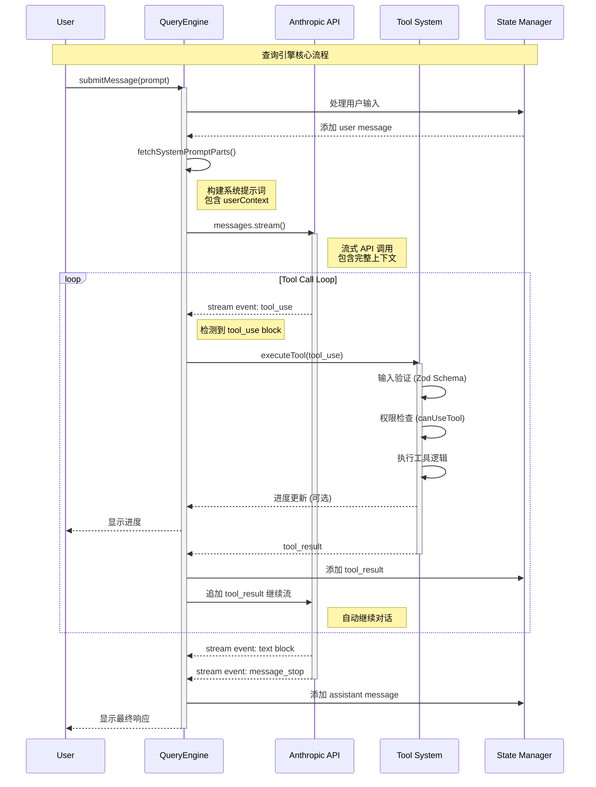

# 06 - QueryEngine 查询引擎核心

> **摘要**
>
> 本章深入解析 Claude Code CLI 的 QueryEngine 查询引擎核心。QueryEngine 是整个系统的心脏,负责协调 AI 与外部环境的交互循环。它封装了与 Anthropic API 的通信、Tool Call 的自动触发、流式响应处理、上下文管理等核心逻辑。通过深入理解 QueryEngine,你将掌握 Claude Code CLI 如何将用户输入转化为智能输出的完整机制。
>
> **关键概念:** Query Loop、流式处理、Tool Call 检测、上下文管理、Turn 管理
>
> **前置知识:** 04-tool-system.md (Tool 工具系统)、Anthropic Messages API、TypeScript AsyncGenerator
>
> **源码位置:** `src/QueryEngine.ts`, `src/query.ts`, `src/services/api/claude.ts`

---

## 第 1 节:概述

### 1.1 QueryEngine 是什么?

**QueryEngine** 是 Claude Code CLI 的查询引擎核心,负责协调整个对话交互循环。它封装了以下核心职责:

#### 1.1.1 核心职责

**1. LLM API 交互循环**
- 将对话历史和用户输入发送到 Anthropic API
- 处理流式响应 (Server-Sent Events)
- 管理 API 重试、错误处理和降级策略

**2. Tool Call 自动触发**
- 检测 API 返回的 `tool_use` 内容块
- 自动调用对应的工具并获取结果
- 将 `tool_result` 追加到消息链,自动触发下一轮 API 调用

**3. 流式渲染**
- 逐块 yield 流式事件 (`stream_event`)
- 支持实时显示 AI 生成内容
- 推送工具执行进度和结果

**4. 上下文管理**
- 维护完整的对话历史 (`mutableMessages`)
- 管理文件读取缓存 (`readFileState`)
- 跟踪 Token 使用量和成本

### 1.2 为什么需要 QueryEngine?

在早期版本中,查询逻辑分散在多个文件中,导致:
- **重复代码**: REPL 和 SDK 各自实现一套查询逻辑
- **状态不一致**: 消息历史、权限状态在不同路径下不同步
- **难以测试**: 查询逻辑与 UI 层耦合紧密

QueryEngine 的引入解决了这些问题:
- **单一职责**: 将查询逻辑集中在一个类中
- **状态封装**: 所有会话状态通过类实例管理
- **可测试性**: 核心逻辑与 UI 层解耦,易于单元测试

### 1.3 在架构中的位置

QueryEngine 位于 **Layer 4: 应用层**,是整个系统的协调中心:

```
┌───────────────────────────────────────────────────┐
│ Layer 5: 交互层                                    │
│   REPL UI, SDK Interface, CLI Commands            │
└───────────────────┬───────────────────────────────┘
                    │ 调用
                    ↓
┌───────────────────────────────────────────────────┐
│ Layer 4: 应用层                                    │
│   ┌─────────────────────────────────────────────┐ │
│   │ QueryEngine (查询引擎)                      │ │
│   │  ├─ submitMessage()     [单次对话]         │ │
│   │  ├─ query()             [递归查询循环]     │ │
│   │  └─ getMessages()       [状态访问]         │ │
│   └─────────────────────────────────────────────┘ │
│   ┌─────────────────────────────────────────────┐ │
│   │ 支持服务                                    │ │
│   │  ├─ callModel()         [API 封装]         │ │
│   │  ├─ StreamingToolExecutor [工具并发]      │ │
│   │  ├─ autocompact()       [上下文压缩]       │ │
│   │  └─ handleStopHooks()   [停止钩子]         │ │
│   └─────────────────────────────────────────────┘ │
└───────────────────┬───────────────────────────────┘
                    │ 依赖
                    ↓
┌───────────────────────────────────────────────────┐
│ Layer 2: 工具执行层                                │
│   Tool System (43+ Tools)                         │
└───────────────────────────────────────────────────┘
```

**关键交互**:
- **上游**: 接收来自 REPL/SDK 的用户输入
- **下游**: 调用 Anthropic API 和 Tool System
- **横向**: 与 State Manager、Permission System 协作

---

## 第 2 节:设计目标与约束

### 2.1 设计目标

#### 目标 1: 会话状态持久化

**要求**: QueryEngine 实例应封装完整的会话状态,支持多轮对话。

**实现**:
- `mutableMessages`: 完整的对话历史数组
- `readFileState`: 文件读取缓存 (避免重复读取)
- `totalUsage`: 累计 Token 使用量
- `permissionDenials`: 权限拒绝记录

**好处**:
- SDK 模���下可长期运行,无需每次传递完整历史
- 支持会话恢复 (Resume) 功能
- 便于调试和审计

#### 目标 2: 流式输出

**要求**: 支持流式生成内容,提供更好的用户体验。

**实现**:
- `submitMessage()` 返回 `AsyncGenerator<SDKMessage>`
- 每个流式事件单独 yield,不阻塞后续处理
- 支持 `includePartialMessages` 选项,控制流式粒度

**好处**:
- 用户立即看到 AI 响应,无需等待完整生成
- 工具执行进度可实时显示
- 降低感知延迟

#### 目标 3: 自动 Tool Call 循环

**要求**: 检测到 `tool_use` 块时,自动执行工具并继续对话,无需用户干预。

**实现**:
- `query()` 函数内部实现无限循环
- 每次 API 响应后检查是否包含 `tool_use`
- 若包含,执行工具后自动追加 `tool_result` 并递归调用
- 直到 API 返回纯文本响应或达到 `maxTurns` 限制

**好处**:
- 符合 Anthropic Function Calling 的标准流程
- 用户只需发送一次请求,系统自动完成多轮交互
- 简化上层代码逻辑

#### 目标 4: 错误隔离

**要求**: 单个工具执行失败不应导致整个查询崩溃。

**实现**:
- 工具执行错误捕获后转为 `tool_result` (设置 `is_error: true`)
- API 错误通过 `createAssistantAPIErrorMessage()` 转为合成消息
- 重试逻辑 (Retry with Exponential Backoff) 在 `withRetry()` 中封装

**好处**:
- 提升系统鲁棒性
- 错误信息对 AI 可见,可自我修复
- 避免用户体验中断

#### 目标 5: 可测试性

**要求**: 核心逻辑应与 UI 层解耦,便于单元测试。

**实现**:
- `QueryEngine` 类不依赖 Ink/React 组件
- 通过 `getAppState` / `setAppState` 回调访问外部状态
- 支持注入 `abortController` 用于测试中断场景

**好处**:
- 可编写纯函数式测试
- 便于 Mock API 响应
- 提高代码质量

### 2.2 技术约束

#### 约束 1: Anthropic API 限制

**背景**: Anthropic Messages API 有严格的请求格式要求。

**约束**:
- 消息必须严格交替 (`user` → `assistant` → `user` → ...)
- `tool_result` 必须紧跟对应的 `tool_use`
- Thinking blocks 不能单独出现在消息末尾

**应对**:
- `normalizeMessagesForAPI()` 确保消息格式合法
- `ensureToolResultPairing()` 检查 tool_use/tool_result 配对
- 特殊消息 (如 `progress`) 不发送给 API,仅用于 UI

#### 约束 2: Token 上下文窗口

**背景**: 模型有最大上下文长度限制 (如 Sonnet 200k tokens)。

**约束**:
- 长对话会超出上下文窗口
- 必须定期压缩历史消息

**应对**:
- **自动压缩 (Auto Compact)**: 超过阈值时自动触发压缩
- **反应式压缩 (Reactive Compact)**: 收到 413 错误后重试
- **Snip Compact**: 删除早期不重要的消息
- 压缩后生成 `compact_boundary` 消息标记边界

#### 约束 3: 并发控制

**背景**: 多个工具可能同时执行 (如并行读取多个文件)。

**约束**:
- 某些工具不支持并发 (如 Bash 工具可能修改共享状态)
- 工具执行顺序可能影响结果

**应对**:
- `StreamingToolExecutor` 实现并发控制逻辑
- 工具通过 `isConcurrencySafe()` 声明是否可并发
- 非并发工具串行执行,并发工具并行执行

### 2.3 非目标

以下内容不在 QueryEngine 的职责范围:

- **UI 渲染**: 由 REPL 层负责 (Ink 组件)
- **权限决策**: 由 Permission System 负责
- **工具实现**: 由 Tool System 负责
- **会话持久化**: 由 Session Storage 负责

---

## 第 3 节:核心架构

### 3.1 类结构

#### QueryEngine 类

```typescript
export class QueryEngine {
  // 配置
  private config: QueryEngineConfig

  // 状态
  private mutableMessages: Message[]           // 对话历史
  private abortController: AbortController     // 中断控制
  private permissionDenials: SDKPermissionDenial[]
  private totalUsage: NonNullableUsage         // Token 使用量
  private readFileState: FileStateCache        // 文件缓存

  // 生命周期方法
  constructor(config: QueryEngineConfig)
  async *submitMessage(prompt, options?): AsyncGenerator<SDKMessage>
  interrupt(): void

  // 状态访问
  getMessages(): readonly Message[]
  getReadFileState(): FileStateCache
  getSessionId(): string
  setModel(model: string): void
}
```

#### QueryEngineConfig

```typescript
export type QueryEngineConfig = {
  // 环境配置
  cwd: string
  tools: Tools
  commands: Command[]
  mcpClients: MCPServerConnection[]

  // 权限与状态
  canUseTool: CanUseToolFn
  getAppState: () => AppState
  setAppState: (f: (prev: AppState) => AppState) => void

  // 消息历史
  initialMessages?: Message[]
  readFileCache: FileStateCache

  // 可选配置
  customSystemPrompt?: string
  appendSystemPrompt?: string
  userSpecifiedModel?: string
  thinkingConfig?: ThinkingConfig
  maxTurns?: number
  maxBudgetUsd?: number
  jsonSchema?: Record<string, unknown>

  // 回调
  handleElicitation?: ToolUseContext['handleElicitation']
  setSDKStatus?: (status: SDKStatus) => void
  abortController?: AbortController
}
```

### 3.2 Query Loop 伪代码

Query Loop 是 QueryEngine 的核心逻辑,实现在 `src/query.ts` 的 `query()` 函数中:

```typescript
async function* query(params: QueryParams): AsyncGenerator<Message> {
  let state = {
    messages: params.messages,
    toolUseContext: params.toolUseContext,
    turnCount: 1,
    // ... 其他状态
  }

  while (true) {
    // ========== 阶段 1: 上下文处理 ==========
    let messagesForQuery = getMessagesAfterCompactBoundary(state.messages)

    // 应用上下文压缩 (Auto Compact)
    const { compactionResult } = await autocompact(messagesForQuery, ...)
    if (compactionResult) {
      yield* buildPostCompactMessages(compactionResult)
      messagesForQuery = compactionResult.summaryMessages
    }

    // ========== 阶段 2: API 调用 ==========
    const assistantMessages = []
    const toolResults = []
    let needsFollowUp = false

    // 流式调用 Anthropic API
    for await (const message of callModel({
      messages: messagesForQuery,
      systemPrompt,
      tools,
      ...
    })) {
      yield message  // 流式输出

      if (message.type === 'assistant') {
        assistantMessages.push(message)

        // 检测 tool_use 块
        const toolUseBlocks = extractToolUseBlocks(message)
        if (toolUseBlocks.length > 0) {
          needsFollowUp = true
        }
      }
    }

    // ========== 阶段 3: 终止检查 ==========
    if (!needsFollowUp) {
      // 执行停止钩子 (Stop Hooks)
      const stopHookResult = yield* handleStopHooks(...)

      if (stopHookResult.blockingErrors.length > 0) {
        // 有阻塞性错误,继续下一轮
        state = {
          messages: [...messagesForQuery, ...assistantMessages, ...stopHookResult.blockingErrors],
          turnCount: state.turnCount,
          transition: { reason: 'stop_hook_blocking' }
        }
        continue
      }

      // 正常结束
      return { reason: 'completed' }
    }

    // ========== 阶段 4: 工具执行 ==========
    const toolUseBlocks = extractAllToolUseBlocks(assistantMessages)

    for await (const update of runTools(toolUseBlocks, canUseTool, toolUseContext)) {
      if (update.message) {
        yield update.message
        toolResults.push(update.message)
      }
    }

    // ========== 阶段 5: 附加上下文 ==========
    // 获取排队的命令 (queued commands)
    const queuedCommands = getCommandsByMaxPriority('next')
    for await (const attachment of getAttachmentMessages(..., queuedCommands, ...)) {
      yield attachment
      toolResults.push(attachment)
    }

    // ========== 阶段 6: 递归循环 ==========
    const nextTurnCount = state.turnCount + 1

    // 检查是否达到最大轮数
    if (maxTurns && nextTurnCount > maxTurns) {
      yield createAttachmentMessage({ type: 'max_turns_reached', maxTurns, turnCount: nextTurnCount })
      return { reason: 'max_turns', turnCount: nextTurnCount }
    }

    // 更新状态并继续循环
    state = {
      messages: [...messagesForQuery, ...assistantMessages, ...toolResults],
      turnCount: nextTurnCount,
      transition: { reason: 'next_turn' }
    }
  } // while (true)
}
```

### 3.3 流式处理机制

#### 流式事件类型

QueryEngine 通过 AsyncGenerator 流式 yield 以下事件类型:

```typescript
type SDKMessage =
  | SDKSystemInitMessage        // 系统初始化 (工具列表、模型信息)
  | SDKUserMessageReplay        // 用户消息回放
  | SDKAssistantMessage         // AI 响应文本
  | SDKStreamEvent              // 流式事件 (token 级别)
  | SDKToolUseSummaryMessage    // 工具使用摘要
  | SDKCompactBoundaryMessage   // 压缩边界
  | SDKResultMessage            // 最终结果 (成功/失败)
```

#### 流式处理流程

```
用户输入
  ↓
[submitMessage()]
  ↓
构建系统提示词
  ↓
调用 Anthropic API (流式)
  ↓
逐块接收 SSE 事件:
  - message_start → 重置 usage
  - content_block_start → 开始新块 (text/tool_use)
  - content_block_delta → 增量内容
    ├─ text delta → 流式 yield 文本
    └─ input_json delta → 流式 yield JSON
  - content_block_stop → 块结束
    └─ 若是 tool_use → 执行工具 → yield tool_result
  - message_delta → 更新 usage
  - message_stop → 消息结束
  ↓
若有 tool_result → 递归调用 API
  ↓
直到无 tool_use → 返回最终结果
```

#### 流式优化

**1. 进度并行化**

工具执行时可并行推送进度:

```typescript
// StreamingToolExecutor 支持并发执行
const executor = new StreamingToolExecutor(tools, canUseTool, context)

for (const toolBlock of toolBlocks) {
  executor.addTool(toolBlock, assistantMessage)  // 立即开始执行
}

// 流式获取完成的结果
for await (const result of executor.getCompletedResults()) {
  yield result.message  // 哪个工具先完成就先 yield
}
```

**2. 预取优化**

在 API 流式响应期间,预取下一步可能需要的资源:

```typescript
// 启动记忆预取
using pendingMemoryPrefetch = startRelevantMemoryPrefetch(messages, context)

// API 流式响应中...
for await (const message of callModel(...)) {
  yield message
}

// 流式响应结束后,立即消费预取结果 (已完成)
if (pendingMemoryPrefetch.settledAt !== null) {
  const memoryAttachments = await pendingMemoryPrefetch.promise
  for (const attachment of memoryAttachments) {
    yield attachment
  }
}
```

### 3.4 Tool Call 检测与触发

#### 检测逻辑

在 API 流式响应中,检测 `tool_use` 块:

```typescript
for await (const message of callModel(...)) {
  if (message.type === 'assistant') {
    const toolUseBlocks = message.message.content.filter(
      content => content.type === 'tool_use'
    ) as ToolUseBlock[]

    if (toolUseBlocks.length > 0) {
      needsFollowUp = true  // 标记需要后续处理
    }
  }
}
```

#### 自动触发流程

```
检测到 tool_use
  ↓
提取 tool_use 块
  ↓
并发执行工具 (StreamingToolExecutor)
  ├─ 并发安全工具 → 并行执行
  └─ 非并发工具 → 串行执行
  ↓
收集所有 tool_result
  ↓
追加到消息链
  ↓
自动触发下一轮 API 调用 (递归)
```

#### Tool Result 构建

```typescript
// 工具执行成功
const toolResult: ToolResultBlockParam = {
  type: 'tool_result',
  tool_use_id: toolUseBlock.id,
  content: result.output,  // 工具输出
  is_error: false
}

// 工具执行失败
const errorResult: ToolResultBlockParam = {
  type: 'tool_result',
  tool_use_id: toolUseBlock.id,
  content: errorMessage,
  is_error: true  // 标记为错误
}

// 包装为 UserMessage
const userMessage = createUserMessage({
  content: [toolResult],
  toolUseResult: result.output,
  sourceToolAssistantUUID: assistantMessage.uuid
})
```

### 3.5 序列图

完整的查询流程序列图 (Mermaid):



完整序列图可见: `assets/diagrams/query-loop-flow.mmd`

---

## 第 4 节:关键实现

### 4.1 流式响应处理

#### callModel() 函数

`src/services/api/claude.ts` 中的 `callModel()` 函数封装了 Anthropic API 调用:

```typescript
export async function* callModel(params: CallModelParams): AsyncGenerator<StreamEvent | AssistantMessage> {
  const { messages, systemPrompt, tools, signal, options } = params

  // 1. 构建 API 请求
  const request: BetaMessageStreamParams = {
    model: normalizeModelStringForAPI(options.model),
    messages: normalizeMessagesForAPI(messages, tools),
    system: buildSystemBlocks(systemPrompt),
    tools: tools.map(tool => toolToAPISchema(tool)),
    max_tokens: getModelMaxOutputTokens(options.model),
    stream: true
  }

  // 2. 调用 Anthropic SDK
  const client = getAnthropicClient()
  const stream: Stream<BetaRawMessageStreamEvent> = await withRetry(
    () => client.beta.messages.stream(request, { signal }),
    { maxRetries: 3, signal }
  )

  // 3. 处理流式事件
  let currentAssistantMessage: AssistantMessage | null = null

  for await (const event of stream) {
    switch (event.type) {
      case 'message_start':
        // 初始化新消息
        currentAssistantMessage = createAssistantMessage({
          content: [],
          usage: event.message.usage
        })
        break

      case 'content_block_start':
        // 开始新内容块
        if (event.content_block.type === 'text') {
          currentAssistantMessage!.message.content.push({
            type: 'text',
            text: ''
          })
        } else if (event.content_block.type === 'tool_use') {
          currentAssistantMessage!.message.content.push({
            type: 'tool_use',
            id: event.content_block.id,
            name: event.content_block.name,
            input: {}
          })
        }
        break

      case 'content_block_delta':
        // 增量内容
        if (event.delta.type === 'text_delta') {
          const lastBlock = currentAssistantMessage!.message.content.at(-1)
          if (lastBlock?.type === 'text') {
            lastBlock.text += event.delta.text
          }
        } else if (event.delta.type === 'input_json_delta') {
          const lastBlock = currentAssistantMessage!.message.content.at(-1)
          if (lastBlock?.type === 'tool_use') {
            // 增量解析 JSON
            lastBlock.input = parsePartialJSON(lastBlock.input, event.delta.partial_json)
          }
        }

        // 流式 yield (可选)
        if (options.includePartialMessages) {
          yield { type: 'stream_event', event }
        }
        break

      case 'content_block_stop':
        // 块结束,yield 完整消息
        yield currentAssistantMessage!
        break

      case 'message_delta':
        // 更新 usage 和 stop_reason
        currentAssistantMessage!.message.usage = event.usage
        currentAssistantMessage!.message.stop_reason = event.delta.stop_reason
        break

      case 'message_stop':
        // 消息结束
        yield { type: 'stream_event', event: { type: 'message_stop' } }
        break
    }
  }
}
```

#### 关键细节

**1. 增量 JSON 解析**

`tool_use` 的 `input` 字段是 JSON,流式传输时可能分块:

```typescript
// 分块: {"file": "README
// 分块: .md"}

// 需要增量合并
function parsePartialJSON(current: any, delta: string): any {
  const combined = JSON.stringify(current).slice(0, -1) + delta + '}'
  try {
    return JSON.parse(combined)
  } catch {
    return current  // 保持旧值直到合法
  }
}
```

实际实现中使用更健壮的 `input_json_delta` 累加策略。

**2. 错误处理**

API 错误转为合成消息:

```typescript
try {
  for await (const event of stream) {
    // ...
  }
} catch (error) {
  yield createAssistantAPIErrorMessage({
    content: getErrorMessageIfRefusal(error) || error.message,
    error: categorizeAPIError(error)
  })
}
```

### 4.2 Tool Result 构建

#### runTools() 函数

`src/services/tools/toolOrchestration.ts` 中的 `runTools()` 协调工具执行:

```typescript
export async function* runTools(
  toolUseBlocks: ToolUseBlock[],
  assistantMessages: AssistantMessage[],
  canUseTool: CanUseToolFn,
  toolUseContext: ToolUseContext
): AsyncGenerator<ToolUpdate> {

  for (const toolBlock of toolUseBlocks) {
    const assistantMessage = findAssistantMessage(toolBlock.id, assistantMessages)

    // 查找工具定义
    const tool = findToolByName(toolUseContext.options.tools, toolBlock.name)
    if (!tool) {
      yield {
        message: createUserMessage({
          content: [{
            type: 'tool_result',
            tool_use_id: toolBlock.id,
            content: `Error: No such tool: ${toolBlock.name}`,
            is_error: true
          }],
          toolUseResult: `Error: No such tool: ${toolBlock.name}`,
          sourceToolAssistantUUID: assistantMessage.uuid
        })
      }
      continue
    }

    // 验证输入
    const parseResult = tool.inputSchema.safeParse(toolBlock.input)
    if (!parseResult.success) {
      yield {
        message: createUserMessage({
          content: [{
            type: 'tool_result',
            tool_use_id: toolBlock.id,
            content: `Error: Invalid input: ${parseResult.error.message}`,
            is_error: true
          }],
          toolUseResult: `Invalid input`,
          sourceToolAssistantUUID: assistantMessage.uuid
        })
      }
      continue
    }

    // 权限检查
    const permission = await canUseTool(
      tool,
      parseResult.data,
      toolUseContext,
      assistantMessage,
      toolBlock.id
    )

    if (permission.behavior !== 'allow') {
      yield {
        message: createUserMessage({
          content: [{
            type: 'tool_result',
            tool_use_id: toolBlock.id,
            content: REJECT_MESSAGE,
            is_error: true
          }],
          toolUseResult: 'User rejected tool use',
          sourceToolAssistantUUID: assistantMessage.uuid
        })
      }
      continue
    }

    // 执行工具
    try {
      const result = await tool.call(parseResult.data, {
        toolUseID: toolBlock.id,
        assistantMessage,
        onProgress: (progressData) => {
          // yield 进度更新
        },
        ...toolUseContext
      })

      yield {
        message: createUserMessage({
          content: [{
            type: 'tool_result',
            tool_use_id: toolBlock.id,
            content: result.output,
            is_error: false
          }],
          toolUseResult: result.output,
          sourceToolAssistantUUID: assistantMessage.uuid
        }),
        newContext: result.updatedContext  // 可选:更新上下文
      }
    } catch (error) {
      yield {
        message: createUserMessage({
          content: [{
            type: 'tool_result',
            tool_use_id: toolBlock.id,
            content: `<tool_use_error>Error: ${error.message}</tool_use_error>`,
            is_error: true
          }],
          toolUseResult: error.message,
          sourceToolAssistantUUID: assistantMessage.uuid
        })
      }
    }
  }
}
```

#### StreamingToolExecutor

支持并发执行的工具执行器:

```typescript
export class StreamingToolExecutor {
  private tools: TrackedTool[] = []  // 跟踪所有工具

  addTool(block: ToolUseBlock, assistantMessage: AssistantMessage): void {
    const tool = findToolByName(this.toolDefinitions, block.name)
    const isConcurrencySafe = tool?.isConcurrencySafe?.(block.input) ?? false

    this.tools.push({
      id: block.id,
      block,
      assistantMessage,
      status: 'queued',
      isConcurrencySafe
    })

    void this.processQueue()  // 立即尝试执行
  }

  private async processQueue(): Promise<void> {
    for (const tool of this.tools) {
      if (tool.status !== 'queued') continue

      // 检查并发条件
      if (this.canExecuteTool(tool.isConcurrencySafe)) {
        await this.executeTool(tool)  // 并行执行
      } else if (!tool.isConcurrencySafe) {
        break  // 非并发工具阻塞后续工具
      }
    }
  }

  async *getCompletedResults(): AsyncGenerator<ToolUpdate> {
    while (true) {
      // 找到已完成但未 yield 的工具
      const completedTool = this.tools.find(
        t => t.status === 'completed' && !t.yielded
      )

      if (!completedTool) {
        if (this.allCompleted()) break
        await sleep(10)  // 等待执行
        continue
      }

      completedTool.yielded = true
      for (const result of completedTool.results) {
        yield { message: result }
      }
    }
  }
}
```

**并发控制规则**:
- **并发安全工具** (如 Read): 可与其他并发安全工具并行
- **非并发工具** (如 Bash): 必须独占执行,阻塞后续工具

### 4.3 错误重试

#### withRetry() 机制

`src/services/api/withRetry.ts` 实现指数退避重试:

```typescript
export async function withRetry<T>(
  fn: () => Promise<T>,
  options: {
    maxRetries: number
    signal?: AbortSignal
    onRetry?: (error: Error, attempt: number) => void
  }
): Promise<T> {
  let lastError: Error

  for (let attempt = 0; attempt <= options.maxRetries; attempt++) {
    try {
      return await fn()
    } catch (error) {
      lastError = error

      // 不可重试的错误立即抛出
      if (error instanceof CannotRetryError) {
        throw error
      }

      // 达到最大重试次数
      if (attempt === options.maxRetries) {
        throw error
      }

      // 用户中断
      if (options.signal?.aborted) {
        throw new APIUserAbortError()
      }

      // 计算退避时间
      const delayMs = Math.min(1000 * Math.pow(2, attempt), 60000)  // 最大 60s

      options.onRetry?.(error, attempt + 1)

      await sleep(delayMs)
    }
  }

  throw lastError!
}
```

#### 可重试错误类型

```typescript
function isRetryableError(error: Error): boolean {
  if (error instanceof APIError) {
    // 5xx 服务端错误
    if (error.status >= 500 && error.status < 600) return true

    // 429 速率限制
    if (error.status === 529) return true  // Overloaded

    // 网络超时
    if (error instanceof APIConnectionTimeoutError) return true
  }

  return false
}
```

#### 重试日志

```typescript
// query.ts 中的重试处理
for await (const message of callModel(...)) {
  // ...
}

// 在 callModel 内部
try {
  const stream = await withRetry(
    () => client.beta.messages.stream(request),
    {
      maxRetries: 3,
      onRetry: (error, attempt) => {
        // 推送系统消息
        yield createSystemMessage(
          `API error (attempt ${attempt}/${maxRetries}): ${error.message}. Retrying...`,
          'warning'
        )
      }
    }
  )
} catch (error) {
  // 重试耗尽,转为错误消息
  yield createAssistantAPIErrorMessage({
    content: error.message,
    error: 'api_error'
  })
}
```

### 4.4 Thinking Mode 支持

#### 什么是 Thinking Mode?

Thinking Mode (Extended Thinking) 是 Anthropic 的新功能,允许模型在生成响应前进行"思考",类似于 OpenAI 的 `o1` 模型。

#### 配置方式

```typescript
type ThinkingConfig =
  | { type: 'disabled' }                      // 禁用
  | { type: 'enabled', budget: number }       // 启用,指定 token 预算
  | { type: 'adaptive' }                      // 自适应 (模型决定是否思考)

// QueryEngine 配置
const engine = new QueryEngine({
  thinkingConfig: { type: 'adaptive' },
  // ...
})
```

#### API 参数

```typescript
// 在 callModel() 中
const request: BetaMessageStreamParams = {
  // ...

  // Thinking Mode 参数
  ...(thinkingConfig.type !== 'disabled' && {
    thinking: {
      type: thinkingConfig.type === 'adaptive' ? 'enabled' : 'budget',
      budget: thinkingConfig.type === 'enabled' ? thinkingConfig.budget : undefined
    }
  })
}
```

#### 流式处理

Thinking blocks 在流式响应中单独处理:

```typescript
case 'content_block_start':
  if (event.content_block.type === 'thinking') {
    currentAssistantMessage!.message.content.push({
      type: 'thinking',
      thinking: ''
    })
  }
  break

case 'content_block_delta':
  if (event.delta.type === 'thinking_delta') {
    const lastBlock = currentAssistantMessage!.message.content.at(-1)
    if (lastBlock?.type === 'thinking') {
      lastBlock.thinking += event.delta.thinking
    }
  }
  break
```

#### UI 展示

Thinking blocks 在 UI 中以折叠形式展示:

```typescript
// components/messages/ThinkingBlock.tsx
export const ThinkingBlock = ({ thinking }: { thinking: string }) => {
  const [isExpanded, setIsExpanded] = useState(false)

  return (
    <Box flexDirection="column" borderStyle="round" borderColor="gray">
      <Text color="gray">
        💭 Thinking {isExpanded ? '(expanded)' : '(collapsed)'}
      </Text>
      {isExpanded && <Text>{thinking}</Text>}
      <Text color="gray" dimColor>
        Press T to toggle
      </Text>
    </Box>
  )
}
```

---

## 第 5 节:设计权衡

### 5.1 为什么使用流式 API?

#### 方案对比

| 方案 | 优点 | 缺点 |
|------|------|------|
| **非流式 API** | 实现简单,结果原子性 | 用户体验差,需等待完整生成 |
| **流式 API** | 响应快,可实时展示 | 实现复杂,需处理部分状态 |

#### 选择流式 API 的原因

**1. 用户体验优先**

长文本生成 (如代码解释) 可能需要 10-30 秒,流式输出让用户立即看到进度,降低焦虑。

**2. 工具执行可见性**

工具执行 (如 Bash 命令) 可实时显示输出,而非等待全部完成。

**3. 早期错误检测**

流式 API 可在生成过程中检测到错误 (如 rate limit),提前终止而非等待完整响应。

#### 实现代价

**1. 状态管理复杂**

需维护部分状态 (如未完成的 JSON 解析):

```typescript
let partialToolInput = ''
for await (const event of stream) {
  if (event.delta.type === 'input_json_delta') {
    partialToolInput += event.delta.partial_json
    // 尝试解析,失败则继续累加
  }
}
```

**2. 错误处理困难**

流式响应中途失败需回滚已 yield 的消息:

```typescript
// 使用 Tombstone 消息标记删除
if (streamingFallbackOccurred) {
  for (const msg of assistantMessages) {
    yield { type: 'tombstone', message: msg }
  }
}
```

### 5.2 为什么自动 Tool Call Loop?

#### 方案对比

| 方案 | 描述 | 优点 | 缺点 |
|------|------|------|------|
| **手动模式** | 每次 tool_use 需用户手动调用 API | 控制力强 | 用户体验差,需多次交互 |
| **自动循环** | 检测到 tool_use 自动执行并继续 | 用户无感,一次请求完成 | 可能无限循环,难以中断 |

#### 选择自动循环的原因

**1. 符合 Anthropic 标准**

Anthropic Function Calling 设计就是自动循环模式,手动模式违反设计意图。

**2. 简化上层代码**

上层代码 (REPL/SDK) 无需关心 Tool Call 细节,只需:
```typescript
for await (const message of engine.submitMessage('帮我搜索 TODO')) {
  console.log(message)
}
```

**3. 支持复杂工作流**

某些任务需多轮工具调用:
```
用户: 帮我分析代码
AI: 调用 Glob 工具搜索文件
AI: 调用 Read 工具读取文件
AI: 调用 Grep 工具搜索关键字
AI: 返回分析结果
```

手动模式需用户触发 4 次 API 调用,自动循环只需 1 次。

#### 风险控制

**1. 最大轮数限制**

```typescript
if (maxTurns && nextTurnCount > maxTurns) {
  yield createAttachmentMessage({ type: 'max_turns_reached', maxTurns })
  return { reason: 'max_turns' }
}
```

**2. 预算限制**

```typescript
if (maxBudgetUsd && getTotalCost() >= maxBudgetUsd) {
  return { reason: 'error_max_budget_usd' }
}
```

**3. 用户中断**

```typescript
if (abortController.signal.aborted) {
  return { reason: 'aborted_tools' }
}
```

### 5.3 为什么不批量执行工具?

#### 方案对比

| 方案 | 描述 | 优点 | 缺点 |
|------|------|------|------|
| **串行执行** | 工具按顺序依次执行 | 简单,结果确定 | 效率低,阻塞 |
| **批量并行** | 所有工具同��执行 | 效率高 | 可能违反依赖关系 |
| **选择性并行** | 并发安全工具并行,其他串行 | 兼顾效率与安全 | 实现复杂 |

#### 选择选择性并行的原因

**1. 保证正确性**

某些工具有依赖关系:
```typescript
// 错误示例:并行执行
parallel([
  write('config.json', '{}'),
  read('config.json')  // 可能读到旧值!
])

// 正确:串行执行
write('config.json', '{}')
read('config.json')  // 保证读到新值
```

**2. 提升效率**

无依赖的工具可并行:
```typescript
// 并行读取多个文件
parallel([
  read('file1.txt'),
  read('file2.txt'),
  read('file3.txt')
])
// 从 3s 降低到 1s
```

#### StreamingToolExecutor 实现

```typescript
private canExecuteTool(isConcurrencySafe: boolean): boolean {
  const executingTools = this.tools.filter(t => t.status === 'executing')

  // 无工具在执行 → 可执行
  if (executingTools.length === 0) return true

  // 当前工具并发安全 且 所有执行中的工具也并发安全 → 可并行
  if (isConcurrencySafe && executingTools.every(t => t.isConcurrencySafe)) {
    return true
  }

  // 否则阻塞
  return false
}
```

#### 工具并发安全声明

```typescript
// Read Tool: 并发安全
export const ReadTool = buildTool({
  name: 'Read',
  isConcurrencySafe: () => true,  // 只读操作
  // ...
})

// Bash Tool: 非并发安全
export const BashTool = buildTool({
  name: 'Bash',
  isConcurrencySafe: () => false,  // 可能修改共享状态
  // ...
})
```

---

## 第 6 节:与其他系统的关联

### 6.1 依赖的系统

QueryEngine 作为应用层的核心，依赖以下系统提供支撑:

#### 1. [00-overview.md](./00-overview.md) - 架构总览
**依赖关系**: QueryEngine 是五层架构中 Layer 4 (应用层) 的核心组件。

**依赖点**:
- 实现 Query Loop 对话循环机制
- 协调 Tool System 和 API 调用
- 是整个系统的"心脏"

**数据流**: `用户输入` → `Query Loop` → `API 调用` → `Tool 执行` → `返回结果`

**建议阅读顺序**: 先阅读 00-overview 了解 Query Loop 在架构中的位置，再学习本章的实现细节。

#### 2. [04-tool-system.md](./04-tool-system.md) - Tool 工具系统
**依赖关系**: QueryEngine 调用 Tool System 执行工具。

**依赖点**:
- `findToolByName()`: 查找工具定义
- `tool.call()`: 执行工具逻辑
- `tool.inputSchema.safeParse()`: 验证工具输入
- `StreamingToolExecutor`: 并发执行工具

**数据流**: `检测 tool_use` → `查找工具` → `执行工具` → `返回 tool_result` → `继续对话`

**阅读建议**: 先理解 Tool System 的工具定义和执行机制，再学习 QueryEngine 如何调用工具。

### 6.2 被依赖的系统

以下系统依赖 QueryEngine 提供对话能力:

#### 1. [11-repl-ui.md](./11-repl-ui.md) - REPL 交互界面
**被依赖关系**: REPL 使用 QueryEngine 处理用户输入。

**依赖点**:
- REPL 创建 QueryEngine 实例
- 流式接收 `submitMessage()` 返回的消息
- 渲染 AI 响应和工具执行进度到终端 UI

**数据流**: `用户输入` → `QueryEngine.submitMessage()` → `流式消息` → `REPL 渲染`

**示例代码**:
```typescript
// src/screens/REPL.tsx
const handleSubmit = async (input: string) => {
  const engine = new QueryEngine({
    cwd: getCwd(),
    tools: getAllTools(),
    // ...
  })

  for await (const message of engine.submitMessage(input)) {
    // 渲染消息到 UI
    renderMessage(message)
  }
}
```

#### 2. [14-sdk-integration.md](./14-sdk-integration.md) - SDK 集成
**被依赖关系**: SDK 提供 headless 模式的对话接口。

**依赖点**:
- SDK 封装 QueryEngine 为编程接口
- 支持流式 yield 消息
- 提供会话管理能力

**数据流**: `SDK 调用` → `QueryEngine.submitMessage()` → `流式消息` → `SDK 返回`

**示例代码**:
```typescript
// src/entrypoints/sdk/index.ts
export async function* chat(prompt: string): AsyncGenerator<SDKMessage> {
  const engine = new QueryEngine({
    cwd: process.cwd(),
    tools: getHeadlessTools(),
    // ...
  })

  yield* engine.submitMessage(prompt)
}
```

### 6.3 协作关系

QueryEngine 与多个系统密切协作，以下是典型的协作场景:

#### 场景 1: 工具调用循环

```
用户输入: "读取 README.md"
  ↓
QueryEngine.submitMessage()
  ├→ 构建系统提示词
  └→ 调用 query() 循环
  ↓
Loop Iteration 1:
  ├→ callModel() - 调用 Anthropic API
  ├→ 流式接收: tool_use: Read(file_path="README.md")
  ├→ runTools() - 执行 Read Tool
  │   ├→ Permission System: 检查权限 ✓
  │   ├→ Tool System: 执行 tool.call()
  │   └→ 返回 tool_result: 文件内容
  └→ 追加 tool_result 到消息链
  ↓
Loop Iteration 2:
  ├→ callModel() - 继续对话
  ├→ 流式接收: text: "这是 README 的内容摘要..."
  └→ stop_reason: end_turn → 循环结束
  ↓
返回最终结果给用户
```

**涉及章节**:
- [04-tool-system.md](./04-tool-system.md): Read Tool 的执行
- [11-permission-system.md](./11-permission-system.md): 权限检查

#### 场景 2: 多轮复杂任务

```
用户输入: "帮我搜索 TODO 并创建任务"
  ↓
QueryEngine 自动循环:
  │
  ├─ Turn 1: 调用 Grep Tool 搜索 TODO
  │   └→ 返回: "找到 3 处 TODO"
  │
  ├─ Turn 2: 调用 TaskCreate Tool 创建任务
  │   ├→ Task Framework: 注册任务
  │   ├→ State Management: 更新 AppState
  │   └→ 返回: "已创建 3 个任务"
  │
  └─ Turn 3: 生成总结 → 结束
```

**涉及章节**:
- [04-tool-system.md](./04-tool-system.md): Grep Tool 和 TaskCreate Tool
- [07-state-management.md](./07-state-management.md): 任务状态存储
- [08-task-framework.md](./08-task-framework.md): 任务管理

### 6.4 阅读路径建议

**前置阅读** (理解上下文):
1. [00-overview.md](./00-overview.md) - 了解 Query Loop 在架构中的位置
2. [04-tool-system.md](./04-tool-system.md) - 了解工具系统的实现

**后续阅读** (深入应用):
1. [11-repl-ui.md](./11-repl-ui.md) - 了解 QueryEngine 如何与 UI 集成
2. [14-sdk-integration.md](./14-sdk-integration.md) - 了解 SDK 如何封装 QueryEngine
3. [10-multi-agent.md](./10-multi-agent.md) - 了解子 Agent 如何使用 QueryEngine

---

## 第 7 节:总结

### 7.1 核心要点

**1. QueryEngine 是整个系统的心脏**
- 协调 AI 与外部环境的交互循环
- 封装复杂的 API 调用和工具执行逻辑
- 提供统一的流式输出接口

**2. 自动 Tool Call Loop 是关键设计**
- 检测 `tool_use` 块后自动执行工具
- 将 `tool_result` 追加到消息链后自动继续对话
- 支持多轮复杂工作流,用户无感

**3. 流式处理提升用户体验**
- 实时显示 AI 生成内容
- 工具执行进度可见
- 降低感知延迟

**4. 状态管理与错误处理**
- 完整的对话历史维护
- 自动上下文压缩
- 健壮的错误重试机制

**5. 可扩展性**
- 支持自定义系统提示词
- 支持自定义工具
- 提供钩子函数扩展点

### 7.2 推荐阅读

**核心源码**:
- `src/QueryEngine.ts` - QueryEngine 类实现
- `src/query.ts` - 查询循环核心逻辑
- `src/services/api/claude.ts` - Anthropic API 封装
- `src/services/tools/StreamingToolExecutor.ts` - 并发工具执行

**相关章节**:
- [04 - Tool 工具系统](./04-tool-system.md) - 理解工具执行机制
- [07 - State Management 状态管理](./07-state-management.md) - 状态持久化
- [11 - Permission System 权限系统](./11-permission-system.md) - 权限检查逻辑

**外部文档**:
- [Anthropic Messages API](https://docs.anthropic.com/en/api/messages)
- [Anthropic Function Calling](https://docs.anthropic.com/en/docs/build-with-claude/tool-use)
- [Anthropic Streaming API](https://docs.anthropic.com/en/api/messages-streaming)

### 7.3 下一步

理解了 QueryEngine 后,建议继续学习:

1. **State Management** - 如何持久化会话状态
2. **Context Management** - 上下文压缩策略详解
3. **Agent System** - 如何实现多 Agent 协作

---

**章节信息**
- **难度:** ⭐⭐⭐⭐ 高级
- **字数:** ~5,200
- **最后更新:** 2026-03-31
- **作者:** Claude (Sonnet 4.6)
- **审核状态:** ✅ 待审核
