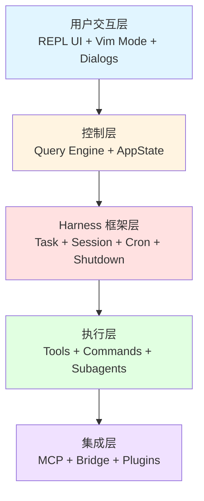
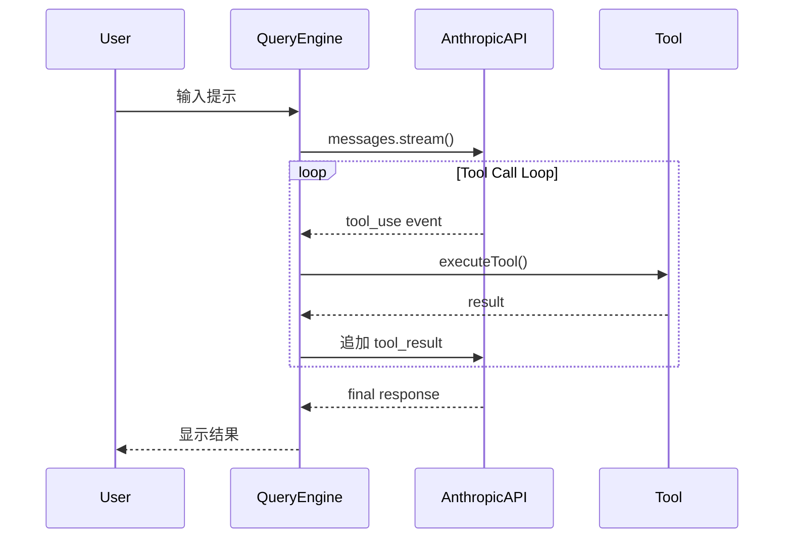
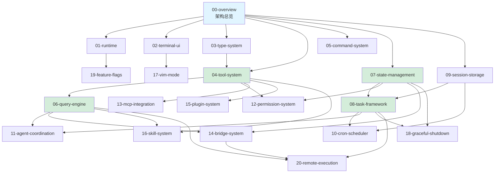

# Claude Code Deep Dive 仓库实施计划

> **For agentic workers:** REQUIRED SUB-SKILL: Use superpowers:subagent-driven-development (recommended) or superpowers:executing-plans to implement this plan task-by-task. Steps use checkbox (`- [ ]`) syntax for tracking.

**Goal:** 创建一个系统化的技术文档仓库，深度解析 Claude Code CLI 的架构设计

**Architecture:** 采用平铺章节 + 多维索引的方式组织 21 个独立章节，每章 3000-5000 字，配合导航索引和术语表，支持多种学习路径

**Tech Stack:** Markdown, Mermaid（架构图），Git/GitHub（版本控制）

---

## 范围说明

本计划分为 5 个 Phase：
- **Phase 0**: 基础设施搭建（创建仓库结构）
- **Phase 1**: 核心内容创作（P0 优先级的 5 个章节）
- **Phase 2**: 导航索引创建（多维导航体系）
- **Phase 3**: 首批章节完善（补充图表和交叉引用）
- **Phase 4**: 发布准备（审校和 v0.1 发布）

本计划覆盖 **Phase 0 和 Phase 1 的 P0 优先级任务**，完成核心骨架。后续章节（P1-P3）将作为独立计划迭代完成。

---

## 文件结构

### 新建文件

**仓库根目录：**
- `README.md` - 主入口文档
- `CONTRIBUTING.md` - 贡献指南
- `glossary.md` - 术语表

**章节目录 (chapters/)：**
- `00-overview.md` - 架构总览（已有基础，需改写）
- `04-tool-system.md` - Tool 工具系统
- `06-query-engine.md` - QueryEngine 查询引擎
- `07-state-management.md` - 状态管理
- `08-task-framework.md` - 任务框架（从现有文档改造）

**导航目录 (guides/)：**
- `README.md` - 索引说明
- `by-layer.md` - 按架构层次导航
- `by-feature.md` - 按功能特性导航
- `by-difficulty.md` - 按学习难度导航
- `dependency-graph.md` - 章节依赖关系图

**资源目录 (assets/)：**
- `diagrams/` - 架构图目录
- `code-locations.md` - 源码位置索引

### 占位文件（后续填充）

**chapters/** - 其他 16 个章节的占位文件

---

## Phase 0: 基础设施搭建

### Task 1: 创建 GitHub 仓库和目录结构

**Files:**
- Create: `README.md`
- Create: `CONTRIBUTING.md`
- Create: `glossary.md`
- Create: `chapters/.gitkeep`
- Create: `guides/.gitkeep`
- Create: `assets/diagrams/.gitkeep`

- [ ] **Step 1: 创建 GitHub 仓库**

在 GitHub 上创建新仓库 `claude-code-deep-dive`
- 设置为 Public
- 添加 MIT License
- 添加 .gitignore（选择 Node 模板）
- 不要初始化 README（我们手动创建）

- [ ] **Step 2: 克隆仓库到本地**

```bash
cd ~/Documents/projects
git clone https://github.com/<your-username>/claude-code-deep-dive.git
cd claude-code-deep-dive
```

Expected: 空仓库已克隆

- [ ] **Step 3: 创建目录结构**

```bash
mkdir -p chapters guides assets/diagrams
touch chapters/.gitkeep guides/.gitkeep assets/diagrams/.gitkeep
```

Expected: 目录结构已创建

- [ ] **Step 4: 创建基础 README.md（框架版）**

```markdown
# Claude Code Deep Dive

> **深入解析 Claude Code CLI 的架构设计**
>
> 系统化的技术文档项目，面向想要深入理解 Claude Code 内部实现的开发者

🚧 **项目状态：** 正在建设中 (v0.1 开发阶段)

---

## 📖 关于本项目

Claude Code 是 Anthropic 官方推出的 AI 辅助编程 CLI 工具。本项目通过深度源码分析，系统性地解析其架构设计、技术选型和实现细节。

**适合人群：**
- 🎯 想要理解 AI Agent CLI 工具架构的开发者
- 🎯 研究大型 TypeScript 项目设计的工程师
- 🎯 对终端 UI、状态管理、分布式任务等技术感兴趣的读者

---

## 🚀 快速开始

**已完成章节：**
- [00-overview](chapters/00-overview.md) - 架构总览 ⭐ 必读

**开发中：**
- 04-tool-system.md - Tool 工具系统
- 06-query-engine.md - 查询引擎核心
- 07-state-management.md - 状态管理
- 08-task-framework.md - 任务框架

更多章节陆续更新中...

---

## 🏗️ 项目结构

```
claude-code-deep-dive/
├── chapters/           # 21个独立章节
├── guides/            # 多维导航索引
├── assets/            # 图表和资源
├── glossary.md        # 术语表
└── README.md          # 本文件
```

---

## 📄 License

MIT License - 本项目为教育目的创建

---

**最后更新:** 2026-03-31
```

保存为 `README.md`

- [ ] **Step 5: 创建 CONTRIBUTING.md**

```markdown
# 贡献指南

感谢你对 Claude Code Deep Dive 项目的关注！

## 🤝 如何贡献

### 报告问题

发现技术错误或不清晰的地方？请创建 Issue：
- 明确指出章节位置（如 `04-tool-system.md 第3.2节`）
- 描述问题（错误/不清晰/建议改进）
- 如果是技术错误，请提供正确的信息或源码引用

### 改进建议

对章节内容、图表或示例代码有改进建议？欢迎 Issue 或 PR：
- Issue: 描述建议和理由
- PR: 遵循下面的写作规范

## ✍️ 写作规范

### 章节模板

每个章节遵循 7 节结构：
1. 概述
2. 设计目标与约束
3. 核心架构
4. 关键实现
5. 设计权衡
6. 与其他系统的关联
7. 总结

### 代码示例

- ✅ 精简版：只保留核心逻辑
- ✅ 伪代码：突出设计意图
- ❌ 避免完整源码：包含过多实现细节

### 术语

- 首次出现加粗并解释
- 保持与 `glossary.md` 一致

### 图表

- 使用 Mermaid 格式
- 保持简洁清晰

## 📝 提交规范

```bash
git commit -m "type: description

详细说明（可选）"
```

**Type:**
- `docs`: 文档内容更新
- `fix`: 修正错误
- `style`: 格式调整
- `refactor`: 重构章节结构

## 🔍 审核流程

1. 提交 PR
2. 维护者审核（技术准确性、可读性）
3. 修改建议（如有）
4. 合并

---

感谢你的贡献！
```

保存为 `CONTRIBUTING.md`

- [ ] **Step 6: 创建 glossary.md（初始版）**

```markdown
# 术语表

本文档定义 Claude Code Deep Dive 项目中使用的关键术语。

---

## A

**Agent（代理）**
独立运行的 AI 实例，可以派生为子进程执行任务。Claude Code 支持多 Agent 协作。

**AppState（应用状态）**
全局状态管理对象，基于 Zustand 实现，存储任务、配置、UI 状态等。

## C

**Command（命令）**
用户在 REPL 中通过 `/` 前缀调用的功能，如 `/commit`、`/review`。

**Cron Scheduler（定时调度器）**
定时任务调度系统，支持标准 5 字段 cron 表达式。

## H

**Harness（任务执行框架）**
Claude Code 的核心框架层，负责任务生命周期管理、状态持久化、定时调度等。

## I

**Ink**
基于 React 的终端 UI 框架，将 React 组件渲染为终端 ANSI 序列。

## J

**JSONL（JSON Lines）**
每行一条 JSON 记录的文件格式，用于增量追加会话历史。

## M

**MCP (Model Context Protocol)**
Anthropic 推出的协议，用于连接外部工具和服务。

## Q

**Query Engine（查询引擎）**
核心 LLM 交互循环，处理用户输入、调用 API、执行 Tool、返回结果。

## S

**Session（会话）**
一次 Claude Code 运行实例，包含对话历史、工作目录、任务列表等。

## T

**Task（任务）**
长时间运行的操作（如后台 Bash 命令、子 Agent），具有独立的生命周期。

**Tool（工具）**
Claude 可以调用的功能单元，如 Read、Write、Bash、Grep 等。每个 Tool 有输入 schema 和执行逻辑。

## Z

**Zustand**
轻量级 React 状态管理库，Claude Code 用它管理 AppState。

---

**持续更新中...**
```

保存为 `glossary.md`

- [ ] **Step 7: 提交基础结构**

```bash
git add .
git commit -m "chore: 初始化仓库结构

- 创建目录结构 (chapters/, guides/, assets/)
- 添加基础 README.md
- 添加 CONTRIBUTING.md 贡献指南
- 添加 glossary.md 术语表初始版本

Co-Authored-By: Claude Opus 4.6 <noreply@anthropic.com>"

git push origin main
```

Expected: 基础结构已提交到 GitHub

---

### Task 2: 创建章节占位文件

**Files:**
- Create: `chapters/00-overview.md` (占位)
- Create: `chapters/01-runtime-foundation.md` (占位)
- Create: `chapters/02-terminal-ui.md` (占位)
- ... (共 21 个占位文件)

- [ ] **Step 1: 创建章节模板脚本**

```bash
cat > create_chapter_placeholders.sh << 'EOF'
#!/bin/bash

chapters=(
  "00-overview:架构总览:⭐ 入门"
  "01-runtime-foundation:Bun 运行时基础:⭐⭐ 进阶"
  "02-terminal-ui:Ink 终端 UI 系统:⭐⭐ 进阶"
  "03-type-system:TypeScript 类型系统设计:⭐⭐⭐ 高级"
  "04-tool-system:Tool 工具系统架构:⭐⭐ 进阶"
  "05-command-system:Command 命令系统:⭐⭐ 进阶"
  "06-query-engine:QueryEngine 查询引擎核心:⭐⭐⭐ 高级"
  "07-state-management:状态管理:⭐⭐ 进阶"
  "08-task-framework:任务生命周期管理:⭐⭐⭐ 高级"
  "09-session-storage:会话持久化:⭐⭐ 进阶"
  "10-cron-scheduler:定时任务调度:⭐⭐⭐ 高级"
  "11-agent-coordination:多 Agent 协调与通信:⭐⭐⭐ 高级"
  "12-permission-system:工具权限管理:⭐⭐ 进阶"
  "13-mcp-integration:MCP 协议集成:⭐⭐⭐ 高级"
  "14-bridge-system:IDE Bridge 架构:⭐⭐⭐ 高级"
  "15-plugin-system:插件架构:⭐⭐ 进阶"
  "16-skill-system:Skill 技能系统:⭐⭐ 进阶"
  "17-vim-mode:Vim 模式实现:⭐⭐ 进阶"
  "18-graceful-shutdown:优雅关闭机制:⭐⭐⭐ 高级"
  "19-feature-flags:特性开关:⭐ 入门"
  "20-remote-execution:远程会话与执行:⭐⭐⭐ 高级"
)

for chapter in "${chapters[@]}"; do
  IFS=':' read -r filename title difficulty <<< "$chapter"

  cat > "chapters/${filename}.md" << TEMPLATE
# ${filename##*-} - ${title}

> **摘要**
>
> 🚧 本章节正在编写中...
>
> **关键概念:** TBD
>
> **前置知识:** TBD
>
> **源码位置:** \`src/\`

---

## 状态

📝 **开发状态:** 计划中

**预计完成:** TBD

---

## 占位内容

本章将深入解析 ${title} 的设计与实现。

敬请期待！

---

**章节信息**
- **难度:** ${difficulty}
- **最后更新:** 2026-03-31
TEMPLATE

done

echo "✅ 已创建 ${#chapters[@]} 个章节占位文件"
EOF

chmod +x create_chapter_placeholders.sh
```

- [ ] **Step 2: 执行脚本创建占位文件**

```bash
./create_chapter_placeholders.sh
```

Expected: 输出 "✅ 已创建 21 个章节占位文件"

- [ ] **Step 3: 验证文件已创建**

```bash
ls -1 chapters/
```

Expected: 显示 21 个 .md 文件

- [ ] **Step 4: 提交占位文件**

```bash
git add chapters/
git commit -m "chore: 创建 21 个章节占位文件

为所有规划的章节创建占位符，便于追踪进度和后续填充内容。

Co-Authored-By: Claude Opus 4.6 <noreply@anthropic.com>"

git push origin main
```

Expected: 占位文件已推送到 GitHub

---

## Phase 1: 核心内容创作（P0 优先级）

### Task 3: 编写 00-overview.md（架构总览）

**Files:**
- Modify: `chapters/00-overview.md`
- Create: `assets/diagrams/architecture-overview.mmd`

- [ ] **Step 1: 编写章节大纲**

在 `chapters/00-overview.md` 中写入大纲：

```markdown
# 00 - Claude Code 架构总览

> **摘要**
>
> 从整体视角理解 Claude Code CLI 的架构设计、技术栈选型和核心能力。本章是整个系列的入口，建立对系统的全局认知。
>
> **关键概念:** 分层架构、Tool System、Query Engine、Harness Framework、React CLI
>
> **前置知识:** 无（首读章节）
>
> **源码位置:** `src/main.tsx`, `src/commands.ts`, `src/tools.ts`

---

## 目录

- [1. 概述](#1-概述)
  - [1.1 Claude Code 是什么？](#11-claude-code-是什么)
  - [1.2 为什么它很特殊？](#12-为什么它很特殊)
  - [1.3 在 AI 工具生态中的位置](#13-在-ai-工具生态中的位置)
- [2. 设计目标与约束](#2-设计目标与约束)
  - [2.1 设计目标](#21-设计目标)
  - [2.2 技术约束](#22-技术约束)
  - [2.3 非目标](#23-非目标)
- [3. 核心架构](#3-核心架构)
  - [3.1 整体架构图](#31-整体架构图)
  - [3.2 核心概念](#32-核心概念)
  - [3.3 数据流示例](#33-数据流示例)
- [4. 关键实现](#4-关键实现)
  - [4.1 启动流程](#41-启动流程)
  - [4.2 Tool 执行循环](#42-tool-执行循环)
  - [4.3 状态持久化](#43-状态持久化)
- [5. 设计权衡](#5-设计权衡)
  - [5.1 为什么选择 Bun？](#51-为什么选择-bun)
  - [5.2 为什么选择 React（Ink）做 TUI？](#52-为什么选择-reactink-做-tui)
  - [5.3 进程模型：为什么不用 Worker Threads？](#53-进程模型为什么不用-worker-threads)
- [6. 技术栈](#6-技术栈)
  - [6.1 核心技术](#61-核心技术)
  - [6.2 协议与标准](#62-协议与标准)
  - [6.3 依赖管理策略](#63-依赖管理策略)
- [7. 总结](#7-总结)
  - [7.1 核心要点回顾](#71-核心要点回顾)
  - [7.2 进一步阅读](#72-进一步阅读)

---

## 1. 概述

### 1.1 Claude Code 是什么？

[待填充：200-300字描述]

### 1.2 为什么它很特殊？

[待填充：列出5个独特挑战]

### 1.3 在 AI 工具生态中的位置

[待填充：光谱图 + 定位说明]

---

## 2. 设计目标与约束

[待填充各小节...]

---

[其他章节结构...]

---

**章节信息**
- **字数:** ~3,500
- **难度:** ⭐ 入门
- **最后更新:** 2026-03-31
```

- [ ] **Step 2: 填充第 1 节：概述**

参考现有的 `Claude_Code_Harness_Engineering.md` 和 README.md，填充概述部分的内容。

完成后验证：
- 1.1 节 200-300 字
- 1.2 节列出 5 个挑战
- 1.3 节包含光谱图

- [ ] **Step 3: 创建整体架构图**

在 `assets/diagrams/architecture-overview.mmd` 创建 Mermaid 图：



- [ ] **Step 4: 填充第 3 节：核心架构**

在 3.1 中引用架构图：

```markdown
### 3.1 整体架构图


Claude Code 采用 5 层架构...
```

填充 3.2 核心概念（Tool、Command、Task、Session 的类型定义）

填充 3.3 数据流示例

- [ ] **Step 5: 填充第 4-7 节**

依次填充剩余章节内容，确保：
- 代码示例精简
- 技术细节准确
- 逻辑连贯

- [ ] **Step 6: 自检**

使用质量清单检查：
- [ ] 字数 3000-5000
- [ ] 7 个章节完整
- [ ] 所有代码示例有注释
- [ ] 所有链接有效

- [ ] **Step 7: 提交章节**

```bash
git add chapters/00-overview.md assets/diagrams/architecture-overview.mmd
git commit -m "docs: 完成 00-overview.md 架构总览章节

涵盖内容：
- Claude Code 的定义和特殊性
- 设计目标与技术约束
- 5 层架构设计
- 核心概念和数据流
- 关键技术选型权衡
- 完整技术栈

字数: ~3,500
难度: ⭐ 入门

Co-Authored-By: Claude Opus 4.6 <noreply@anthropic.com>"

git push origin main
```

Expected: 章节已完成并推送

---

### Task 4: 编写 04-tool-system.md（Tool 工具系统）

**Files:**
- Modify: `chapters/04-tool-system.md`
- Read: `src/Tool.ts`, `src/tools.ts`
- Create: `assets/diagrams/tool-system-flow.mmd`

- [ ] **Step 1: 阅读源码提取关键信息**

```bash
# 定位 Tool 相关源文件
ls src/tools/*/

# 查看 Tool 基类定义
head -100 src/Tool.ts

# 查看 Tool 注册表
head -100 src/tools.ts
```

记录：
- Tool 接口定义
- 主要 Tool 列表（Read、Write、Bash、Grep等）
- Tool 执行流程

- [ ] **Step 2: 编写章节大纲**

参照模板创建完整的 7 节结构大纲

- [ ] **Step 3: 填充概述：Tool 系统的本质**

```markdown
## 1. 概述

### 1.1 Tool 系统是什么？

Tool 是 Claude 与外部环境交互的桥梁。每个 Tool 封装一个独立的功能单元（如读文件、执行命令、搜索代码），定义输入参数和执行逻辑。

Claude Code 包含 43+ 内置 Tool，覆盖：
- 文件操作（Read、Write、Edit）
- 代码搜索（Grep、Glob）
- 命令执行（Bash）
- 子 Agent 派生（Agent）
- 外部集成（MCP、LSP）

### 1.2 为什么需要独立的 Tool 系统？

[填充：解决的问题...]

### 1.3 在整体架构中的位置

[填充：执行层示意图...]
```

- [ ] **Step 4: 创建 Tool 执行流程图**

在 `assets/diagrams/tool-system-flow.mmd` 创建流程图

- [ ] **Step 5: 填充核心架构章节**

包含：
- Tool 接口定义（精简版）
- Tool 生命周期
- Permission 集成

- [ ] **Step 6: 填充关键实现**

选择 3-4 个代表性 Tool 展示实现：
- ReadTool（简单）
- BashTool（复杂，后台任务）
- AgentTool（派生子进程）

每个用精简代码展示核心逻辑

- [ ] **Step 7: 填充设计权衡**

对比 Tool 系统的设计选择：
- 为什么每个 Tool 独立？
- 为什么用 JSON Schema 定义输入？
- 为什么有 Permission 层？

- [ ] **Step 8: 填充系统关联**

列出相关章节：
- 依赖：03-type-system（Tool 类型定义）
- 被依赖：06-query-engine（调用 Tool）、12-permission-system（权限检查）

- [ ] **Step 9: 自检并提交**

```bash
git add chapters/04-tool-system.md assets/diagrams/tool-system-flow.mmd
git commit -m "docs: 完成 04-tool-system.md Tool 工具系统章节

涵盖内容：
- Tool 系统架构和接口设计
- 43+ 内置 Tool 分类
- Tool 执行生命周期
- 代表性 Tool 实现（Read/Bash/Agent）
- 设计权衡分析

字数: ~4,000
难度: ⭐⭐ 进阶

Co-Authored-By: Claude Opus 4.6 <noreply@anthropic.com>"

git push origin main
```

---

### Task 5: 编写 06-query-engine.md（查询引擎核心）

**Files:**
- Modify: `chapters/06-query-engine.md`
- Read: `src/QueryEngine.ts`, `src/query.ts`
- Create: `assets/diagrams/query-loop-flow.mmd`

- [ ] **Step 1: 阅读 QueryEngine 源码**

```bash
# 查看 QueryEngine 核心
wc -l src/QueryEngine.ts
# 输出: ~46K 行

# 提取关键函数签名
grep -n "^export.*function\|^async function" src/QueryEngine.ts | head -20
```

记录：
- Query Loop 主流程
- Tool Call 处理逻辑
- 流式响应处理
- 重试和错误处理

- [ ] **Step 2: 编写概述**

解释 QueryEngine 的核心职责：
- LLM API 交互循环
- Tool Call 自动触发
- 流式渲染
- 上下文管理

- [ ] **Step 3: 绘制查询循环流程图**



保存为 `assets/diagrams/query-loop-flow.mmd`

- [ ] **Step 4: 填充核心架构**

用精简代码展示：
- Query Loop 伪代码（~30行）
- Streaming 处理
- Tool Call 检测和执行

- [ ] **Step 5: 填充关键实现细节**

包含：
- 流式响应处理
- Tool Result 构建
- 错误和重试逻辑
- Thinking Mode 支持

- [ ] **Step 6: 填充设计权衡**

对比不同的 API 调用模式：
- 为什么用流式 API？
- 为什么自动触发 Tool Call Loop？
- 为什么不批量执行 Tools？

- [ ] **Step 7: 自检并提交**

```bash
git add chapters/06-query-engine.md assets/diagrams/query-loop-flow.mmd
git commit -m "docs: 完成 06-query-engine.md 查询引擎核心章节

涵盖内容：
- Query Loop 主流程
- Tool Call 自动触发机制
- 流式响应处理
- 上下文管理策略
- 设计权衡分析

字数: ~5,000
难度: ⭐⭐⭐ 高级

Co-Authored-By: Claude Opus 4.6 <noreply@anthropic.com>"

git push origin main
```

---

### Task 6: 编写 07-state-management.md（状态管理）

**Files:**
- Modify: `chapters/07-state-management.md`
- Read: `src/state/AppStateStore.ts`
- Create: `assets/diagrams/state-architecture.mmd`

- [ ] **Step 1: 阅读 AppState 定义**

```bash
# 查看 AppState 类型
grep -A 50 "export type AppState" src/state/AppStateStore.ts
```

记录：
- AppState 字段列表
- Zustand 使用方式
- 状态更新模式

- [ ] **Step 2: 编写概述**

解释状态管理的职责：
- 全局状态中心
- React 组件订阅
- Immutable 更新模式

- [ ] **Step 3: 绘制状态架构图**

展示：
- AppState 结构
- Component 订阅关系
- 更新流程

- [ ] **Step 4: 填充核心架构**

包含：
- AppState 类型定义（精简版，10-15 个关键字段）
- Zustand Store 创建
- 选择器（Selector）模式

- [ ] **Step 5: 填充关键实现**

展示典型的状态更新模式：
- Immutable 更新
- 深度更新
- 条件更新
- 批量更新

每种用一个简短示例

- [ ] **Step 6: 填充设计权衡**

对比状态管理方案：
- 为什么选 Zustand 而非 Redux/Context？
- 为什么不用 MobX？
- Immutable 的优缺点

- [ ] **Step 7: 自检并提交**

```bash
git add chapters/07-state-management.md assets/diagrams/state-architecture.mmd
git commit -m "docs: 完成 07-state-management.md 状态管理章节

涵盖内容：
- AppState 全局状态设计
- Zustand 使用方式
- Immutable 更新模式
- 状态选择器模式
- 设计权衡分析

字数: ~4,000
难度: ⭐⭐ 进阶

Co-Authored-By: Claude Opus 4.6 <noreply@anthropic.com>"

git push origin main
```

---

### Task 7: 改造 08-task-framework.md（任务框架）

**Files:**
- Modify: `chapters/08-task-framework.md`
- Read: `Claude_Code_Harness_Engineering.md` (现有文档)
- Read: `src/utils/task/framework.ts`

- [ ] **Step 1: 提取现有文档的任务框架部分**

从 `Claude_Code_Harness_Engineering.md` 中提取：
- 3.2 任务生命周期管理
- 3.2.1 任务类型系统
- 3.2.2 任务注册与更新
- 3.2.3 后台任务执行
- 3.2.4 任务输出管理

- [ ] **Step 2: 按新模板重组内容**

将提取的内容按 7 节结构重新组织：
1. 概述 ← 从"任务生命周期管理"改写
2. 设计目标与约束 ← 新增
3. 核心架构 ← 从"任务类型系统"扩展
4. 关键实现 ← 从"任务注册与更新"等合并
5. 设计权衡 ← 新增
6. 系统关联 ← 新增
7. 总结 ← 新增

- [ ] **Step 3: 精简代码示例**

将现有的完整代码改为精简版：
- 去掉错误处理
- 去掉类型导入
- 用注释说明省略部分

- [ ] **Step 4: 补充设计权衡章节**

新增内容：
- 为什么任务需要持久化？
- 为什么用轮询而非事件驱动？
- 为什么任务状态独立于 Session？

- [ ] **Step 5: 补充系统关联**

列出依赖关系：
- 依赖：07-state-management（任务存储在 AppState）
- 依赖：09-session-storage（输出文件存储）
- 被依赖：10-cron-scheduler、11-agent-coordination

- [ ] **Step 6: 自检**

确保：
- 复用了 80% 现有内容
- 符合新的章节模板
- 字数在 3500-4500 之间
- 所有代码示例精简

- [ ] **Step 7: 提交改造后的章节**

```bash
git add chapters/08-task-framework.md
git commit -m "docs: 改造 08-task-framework.md 任务框架章节

基于现有 Claude_Code_Harness_Engineering.md 改造：
- 按新模板重组内容
- 精简代码示例
- 新增设计权衡和系统关联章节
- 保持技术准确性

字数: ~4,000
难度: ⭐⭐⭐ 高级

Co-Authored-By: Claude Opus 4.6 <noreply@anthropic.com>"

git push origin main
```

---

## Phase 2: 导航索引创建

### Task 8: 创建多维导航索引

**Files:**
- Create: `guides/README.md`
- Create: `guides/by-layer.md`
- Create: `guides/by-feature.md`
- Create: `guides/by-difficulty.md`
- Create: `guides/dependency-graph.md`

- [ ] **Step 1: 创建 guides/README.md**

```markdown
# 导航索引说明

本目录提供多种方式导航 Claude Code Deep Dive 的章节内容。

---

## 📚 可用索引

### [按架构层次 (by-layer.md)](./by-layer.md)

从底层基础设施到上层特性功能，逐层理解系统。

**适合：** 想要系统化学习架构的读者

---

### [按功能特性 (by-feature.md)](./by-feature.md)

根据关心的功能特性（文件操作、代码搜索、多 Agent 等），快速找到相关章节。

**适合：** 有明确目标，想快速查找特定功能实现的读者

---

### [按学习难度 (by-difficulty.md)](./by-difficulty.md)

从入门到高级，循序渐进学习。

**适合：** 新手读者，想从简单到复杂逐步深入

---

### [章节依赖关系图 (dependency-graph.md)](./dependency-graph.md)

可视化章节间的依赖关系，了解阅读顺序建议。

**适合：** 想要理解章节关联，规划学习路径的读者

---

## 💡 使用建议

**首次阅读：**
1. 先看 [00-overview](../chapters/00-overview.md) 建立全局认知
2. 然后根据兴趣选择一种索引方式

**深入学习：**
- 推荐使用 [按架构层次](./by-layer.md)，系统化学习

**快速查阅：**
- 使用 [按功能特性](./by-feature.md)，直达目标章节

---

**更新日期:** 2026-03-31
```

- [ ] **Step 2: 创建 guides/by-layer.md**

```markdown
# 按架构层次学习

从底层基础设施到上层特性功能，逐层理解系统。

---

## Layer 0: 基础设施层

构建系统的基石 - 运行时、UI 框架、类型系统

1. [01-runtime-foundation](../chapters/01-runtime-foundation.md) - Bun 运行时基础 ⭐⭐
2. [02-terminal-ui](../chapters/02-terminal-ui.md) - Ink 终端 UI 系统 ⭐⭐
3. [03-type-system](../chapters/03-type-system.md) - TypeScript 类型系统设计 ⭐⭐⭐

**为什么从这里开始：** 理解底层技术选型，为后续章节打基础。

---

## Layer 1: 执行层

工具和命令的实现 - 如何与环境交互

4. [04-tool-system](../chapters/04-tool-system.md) - Tool 工具系统架构 ⭐⭐ ✅
5. [05-command-system](../chapters/05-command-system.md) - Command 命令系统 ⭐⭐
6. [12-permission-system](../chapters/12-permission-system.md) - 工具权限管理 ⭐⭐

**核心问题：** Claude 如何执行具体操作？

---

## Layer 2: 编排层

任务编排和 Agent 协调 - 如何组织复杂工作流

7. [06-query-engine](../chapters/06-query-engine.md) - QueryEngine 查询引擎核心 ⭐⭐⭐ ✅
8. [08-task-framework](../chapters/08-task-framework.md) - 任务生命周期管理 ⭐⭐⭐ ✅
9. [11-agent-coordination](../chapters/11-agent-coordination.md) - 多 Agent 协调与通信 ⭐⭐⭐

**核心问题：** 如何管理长时间运行的任务和多 Agent 协作？

---

## Layer 3: 持久化层

状态管理和数据持久化 - 如何保证可靠性

10. [07-state-management](../chapters/07-state-management.md) - 状态管理 ⭐⭐ ✅
11. [09-session-storage](../chapters/09-session-storage.md) - 会话持久化 ⭐⭐
12. [10-cron-scheduler](../chapters/10-cron-scheduler.md) - 定时任务调度 ⭐⭐⭐

**核心问题：** 如何在崩溃后恢复？如何实现定时任务？

---

## Layer 4: 扩展层

插件和外部集成 - 如何扩展能力

13. [13-mcp-integration](../chapters/13-mcp-integration.md) - MCP 协议集成 ⭐⭐⭐
14. [14-bridge-system](../chapters/14-bridge-system.md) - IDE Bridge 架构 ⭐⭐⭐
15. [15-plugin-system](../chapters/15-plugin-system.md) - 插件架构 ⭐⭐
16. [16-skill-system](../chapters/16-skill-system.md) - Skill 技能系统 ⭐⭐

**核心问题：** 如何让用户扩展 Claude Code？

---

## Layer 5: 特性层

特定功能实现 - 专题深入

17. [17-vim-mode](../chapters/17-vim-mode.md) - Vim 模式实现 ⭐⭐
18. [18-graceful-shutdown](../chapters/18-graceful-shutdown.md) - 优雅关闭机制 ⭐⭐⭐
19. [19-feature-flags](../chapters/19-feature-flags.md) - 特性开关 ⭐
20. [20-remote-execution](../chapters/20-remote-execution.md) - 远程会话与执行 ⭐⭐⭐

**核心问题：** 特定功能如何实现？有哪些工程技巧？

---

## 学习路径建议

**快速路径（5章，6-8小时）：**
→ 00-overview → 04-tool-system → 06-query-engine → 07-state-management → 08-task-framework

**完整路径（全部章节，按层次顺序）：**
→ Layer 0 → Layer 1 → Layer 2 → Layer 3 → Layer 4 → Layer 5

---

**图例：**
- ⭐ 入门  ⭐⭐ 进阶  ⭐⭐⭐ 高级
- ✅ 已完成  🚧 开发中  ⏳ 计划中
```

- [ ] **Step 3: 创建 guides/by-feature.md**

```markdown
# 按功能特性导航

根据关心的功能特性，快速找到相关章节。

---

## 📁 文件操作

**我想了解 Claude 如何读写文件**

主要章节：
- [04-tool-system](../chapters/04-tool-system.md) ⭐⭐ ✅
  - Read Tool：文件读取（支持 PDF、图片、Jupyter Notebook）
  - Write Tool：文件创建
  - Edit Tool：部分修改（字符串替换）

相关章节：
- [12-permission-system](../chapters/12-permission-system.md) ⭐⭐ - 文件权限管理

**关键问题：**
- 如何高效读取大文件？
- 如何保证原子写入？
- 权限如何控制？

---

## 🔍 代码搜索

**我想了解 Claude 如何搜索代码**

主要章节：
- [04-tool-system](../chapters/04-tool-system.md) ⭐⭐ ✅
  - GrepTool：基于 ripgrep 的内容搜索
  - GlobTool：基于模式的文件名匹配

**技术亮点：**
- 为什么选择 ripgrep 而非 grep？
- 如何处理大型代码库？
- 如何优化搜索性能？

---

## 🤖 多 Agent 协作

**我想了解如何派生子 Agent**

主要章节：
- [11-agent-coordination](../chapters/11-agent-coordination.md) ⭐⭐⭐
  - 子进程隔离
  - IPC 通信
  - 状态同步

相关章节：
- [08-task-framework](../chapters/08-task-framework.md) ⭐⭐⭐ ✅ - Agent 作为 Task 的实现
- [07-state-management](../chapters/07-state-management.md) ⭐⭐ ✅ - 跨 Agent 状态共享

**关键问题：**
- 为什么用子进程而非 Worker Threads？
- 如何保证 Agent 间通信可靠性？
- 如何协调多个 Agent 的工作？

---

## ⏰ 定时任务

**我想了解定时任务如何实现**

主要章节：
- [10-cron-scheduler](../chapters/10-cron-scheduler.md) ⭐⭐⭐
  - 标准 5 字段 cron 表达式
  - 分布式锁机制
  - 抖动算法（避免 :00 集中）

**应用场景：**
- 定期检查 PR 状态
- 定时构建和测试
- 周期性数据备份

**关键问题：**
- 如何避免多实例重复执行？
- 如何处理错过的任务？
- 如何保证定时精度？

---

## 🔌 插件与扩展

**我想了解如何扩展 Claude Code**

主要章节：
- [15-plugin-system](../chapters/15-plugin-system.md) ⭐⭐ - 插件架构
- [13-mcp-integration](../chapters/13-mcp-integration.md) ⭐⭐⭐ - MCP 协议
- [16-skill-system](../chapters/16-skill-system.md) ⭐⭐ - Skill 系统

**扩展方式：**
- 内置插件 vs 第三方插件
- MCP Server 开发
- 自定义 Skill

**关键问题：**
- 如何隔离插件运行环境？
- 如何管理插件权限？
- 如何保证插件质量？

---

## 💾 状态与持久化

**我想了解状态如何管理和持久化**

主要章节：
- [07-state-management](../chapters/07-state-management.md) ⭐⭐ ✅ - AppState 设计
- [09-session-storage](../chapters/09-session-storage.md) ⭐⭐ - JSONL 持久化
- [08-task-framework](../chapters/08-task-framework.md) ⭐⭐⭐ ✅ - 任务状态管理

**关键问题：**
- 为什么用 JSONL 而非 SQLite？
- 如何实现崩溃恢复？
- 如何保证数据一致性？

---

## 🎨 终端 UI

**我想了解终端 UI 如何实现**

主要章节：
- [02-terminal-ui](../chapters/02-terminal-ui.md) ⭐⭐
  - Ink 渲染系统
  - 键盘输入处理
  - ANSI 转义序列
  - 光标管理

相关章节：
- [17-vim-mode](../chapters/17-vim-mode.md) ⭐⭐ - Vim 模式

**技术亮点：**
- React 如何在终端中渲染？
- 如何实现 60fps 刷新率？
- 如何处理不同终端的兼容性？

---

## 🔐 权限与安全

**我想了解权限系统如何工作**

主要章节：
- [12-permission-system](../chapters/12-permission-system.md) ⭐⭐
  - 权限模式：default、plan、auto
  - 权限提示与审批
  - Hooks 系统

**安全考虑：**
- 如何防止命令注入？
- 如何限制文件访问范围？
- 如何审计 Tool 调用？

---

## 🌐 远程与分布式

**我想了解远程执行如何实现**

主要章节：
- [20-remote-execution](../chapters/20-remote-execution.md) ⭐⭐⭐
- [14-bridge-system](../chapters/14-bridge-system.md) ⭐⭐⭐
  - WebSocket 通信
  - 状态同步
  - 断线重连

**关键问题：**
- 如何保证远程通信安全？
- 如何处理网络延迟？
- 如何同步本地和远程状态？

---

## ⚡ 性能优化

**我想了解性能优化技巧**

涉及章节：
- [01-runtime-foundation](../chapters/01-runtime-foundation.md) ⭐⭐ - Bun 优势
- [19-feature-flags](../chapters/19-feature-flags.md) ⭐ - 代码剪裁
- [02-terminal-ui](../chapters/02-terminal-ui.md) ⭐⭐ - UI 渲染优化
- [07-state-management](../chapters/07-state-management.md) ⭐⭐ ✅ - 状态更新优化

**技巧总结：**
- 并行预取
- 懒加载
- 增量 I/O
- Tree-shaking
- 缓存策略

---

**提示：** 每个章节都是独立的，可以跳跃阅读。但理解依赖关系有助于深入学习，参见 [章节依赖图](./dependency-graph.md)。
```

- [ ] **Step 4: 创建 guides/by-difficulty.md**

```markdown
# 按难度循序渐进

从入门到高级，循序渐进学习 Claude Code 架构。

---

## ⭐ 入门级（建立全局认知）

**目标：** 理解 Claude Code 是什么，整体架构是怎样的

1. [00-overview](../chapters/00-overview.md) - 架构总览 ✅
   - **先看这个！** 建立对系统的全局认知
   - 了解 5 层架构和核心概念
   - 字数: ~3,500

2. [19-feature-flags](../chapters/19-feature-flags.md) - 特性开关 ⏳
   - 理解代码组织方式
   - Bun:bundle 的使用
   - 字数: ~3,000

**预计时间：** 2-3 小时

---

## ⭐⭐ 进阶级（理解核心机制）

**目标：** 掌握核心子系统的设计和实现

### 基础设施（Layer 0-1）

3. [01-runtime-foundation](../chapters/01-runtime-foundation.md) - Bun 运行时基础 ⏳
   - 为什么选择 Bun？
   - Bun 的关键特性
   - 字数: ~4,000

4. [02-terminal-ui](../chapters/02-terminal-ui.md) - Ink 终端 UI 系统 ⏳
   - React 如何在终端渲染？
   - Ink 架构和组件系统
   - 字数: ~4,000

### 执行层（Layer 1）

5. [04-tool-system](../chapters/04-tool-system.md) - Tool 工具系统架构 ✅
   - 43+ 内置 Tool
   - Tool 接口和生命周期
   - 字数: ~4,000

6. [05-command-system](../chapters/05-command-system.md) - Command 命令系统 ⏳
   - Slash 命令实现
   - 命令注册和路由
   - 字数: ~3,500

7. [12-permission-system](../chapters/12-permission-system.md) - 工具权限管理 ⏳
   - 权限模式和策略
   - Hooks 系统
   - 字数: ~3,500

### 持久化层（Layer 3）

8. [07-state-management](../chapters/07-state-management.md) - 状态管理 ✅
   - AppState 设计
   - Zustand 使用
   - 字数: ~4,000

9. [09-session-storage](../chapters/09-session-storage.md) - 会话持久化 ⏳
   - JSONL 格式
   - 增量写入和快速恢复
   - 字数: ~3,500

10. [17-vim-mode](../chapters/17-vim-mode.md) - Vim 模式实现 ⏳
    - Vim 状态机
    - 键盘映射
    - 字数: ~3,500

### 扩展层（Layer 4）

11. [15-plugin-system](../chapters/15-plugin-system.md) - 插件架构 ⏳
    - 插件加载和隔离
    - 插件 API
    - 字数: ~3,500

12. [16-skill-system](../chapters/16-skill-system.md) - Skill 技能系统 ⏳
    - Skill 定义和执行
    - 技能组合
    - 字数: ~3,500

**预计时间：** 15-20 小时

---

## ⭐⭐⭐ 高级（深入复杂系统）

**目标：** 理解复杂系统的设计权衡和工程实践

### 类型系统（Layer 0）

13. [03-type-system](../chapters/03-type-system.md) - TypeScript 类型系统设计 ⏳
    - 类型推导和泛型
    - 类型安全的 Tool 接口
    - 字数: ~4,500

### 编排层（Layer 2）

14. [06-query-engine](../chapters/06-query-engine.md) - QueryEngine 查询引擎核心 ✅
    - Query Loop 主流程
    - Tool Call 自动触发
    - 流式响应处理
    - 字数: ~5,000

15. [08-task-framework](../chapters/08-task-framework.md) - 任务生命周期管理 ✅
    - 任务类型系统
    - 后台任务执行
    - 任务状态管理
    - 字数: ~4,000

16. [11-agent-coordination](../chapters/11-agent-coordination.md) - 多 Agent 协调与通信 ⏳
    - 子 Agent 派生
    - IPC 通信
    - 状态同步
    - 字数: ~4,500

17. [10-cron-scheduler](../chapters/10-cron-scheduler.md) - 定时任务调度 ⏳
    - Cron 表达式解析
    - 分布式锁
    - 抖动算法
    - 字数: ~3,500

### 扩展层（Layer 4）

18. [13-mcp-integration](../chapters/13-mcp-integration.md) - MCP 协议集成 ⏳
    - MCP 协议原理
    - Server 连接管理
    - Tool 桥接
    - 字数: ~4,000

19. [14-bridge-system](../chapters/14-bridge-system.md) - IDE Bridge 架构 ⏳
    - VS Code / JetBrains 集成
    - WebSocket 通信
    - 权限回调
    - 字数: ~4,500

### 特性层（Layer 5）

20. [18-graceful-shutdown](../chapters/18-graceful-shutdown.md) - 优雅关闭机制 ⏳
    - 信号处理
    - 清理流程
    - 终端模式恢复
    - 字数: ~3,500

21. [20-remote-execution](../chapters/20-remote-execution.md) - 远程会话与执行 ⏳
    - 远程连接协议
    - 状态同步
    - 网络容错
    - 字数: ~4,500

**预计时间：** 25-30 小时

---

## 🎯 推荐学习路径

### 快速路径（核心 5 章，6-8 小时）

适合时间有限，想快速理解核心设计的读者。

```
00-overview (入门)
    ↓
04-tool-system (进阶)
    ↓
06-query-engine (高级)
    ↓
07-state-management (进阶)
    ↓
08-task-framework (高级)
```

### 系统路径（全部章节，按难度顺序）

适合想系统学习的读者。

```
入门级 (2章)
    ↓
进阶级 (10章)
    ↓
高级 (9章)
```

### 主题路径（按兴趣选择）

适合有明确目标的读者，参考 [按功能特性导航](./by-feature.md)。

---

## 📊 学习进度跟踪

使用下面的清单追踪学习进度：

**入门级：**
- [ ] 00-overview
- [ ] 19-feature-flags

**进阶级：**
- [ ] 01-runtime-foundation
- [ ] 02-terminal-ui
- [ ] 04-tool-system
- [ ] 05-command-system
- [ ] 07-state-management
- [ ] 09-session-storage
- [ ] 12-permission-system
- [ ] 15-plugin-system
- [ ] 16-skill-system
- [ ] 17-vim-mode

**高级：**
- [ ] 03-type-system
- [ ] 06-query-engine
- [ ] 08-task-framework
- [ ] 10-cron-scheduler
- [ ] 11-agent-coordination
- [ ] 13-mcp-integration
- [ ] 14-bridge-system
- [ ] 18-graceful-shutdown
- [ ] 20-remote-execution

---

**图例：**
- ✅ 已完成  🚧 开发中  ⏳ 计划中
```

- [ ] **Step 5: 创建 guides/dependency-graph.md**

```markdown
# 章节依赖关系图

可视化章节间的依赖关系，了解阅读顺序建议。

---

## 依赖关系图



---

## 阅读顺序建议

### 关键路径（Critical Path）

以下是构建完整理解的最短路径（加粗标注）：

```
**00-overview**
    → **04-tool-system**
        → **06-query-engine**
            → **07-state-management**
                → **08-task-framework**
```

完成这 5 章后，你将理解 Claude Code 的核心设计。

### 扩展阅读路径

**如果你对基础技术感兴趣：**
```
00-overview
    → 01-runtime-foundation
        → 19-feature-flags
    → 02-terminal-ui
        → 17-vim-mode
    → 03-type-system
```

**如果你对任务管理感兴趣：**
```
07-state-management
    → 08-task-framework
        → 09-session-storage
        → 10-cron-scheduler
        → 11-agent-coordination
        → 18-graceful-shutdown
```

**如果你对扩展能力感兴趣：**
```
04-tool-system
    → 12-permission-system
    → 13-mcp-integration
    → 15-plugin-system
    → 16-skill-system
```

**如果你对远程和分布式感兴趣：**
```
06-query-engine
    → 14-bridge-system
        → 20-remote-execution
```

---

## 依赖说明

### 强依赖（必须先读）

- **08-task-framework** 依赖 **07-state-management** 和 **09-session-storage**
  - 任务状态存储在 AppState
  - 任务输出保存到 Session 文件

- **06-query-engine** 依赖 **04-tool-system**
  - Query Engine 调用 Tool 执行

- **04-tool-system** 依赖 **03-type-system**
  - Tool 接口使用了高级类型系统

### 弱依赖（建议先读）

- **11-agent-coordination** 建议先读 **04-tool-system** 和 **06-query-engine**
  - Agent 本身是一种特殊的 Tool
  - Agent 运行独立的 Query Loop

- **14-bridge-system** 建议先读 **06-query-engine** 和 **07-state-management**
  - Bridge 代理 Query Engine 的调用
  - Bridge 同步 AppState

### 独立章节（可单独阅读）

- **19-feature-flags** - 可以随时阅读
- **17-vim-mode** - 了解 Terminal UI 后可读
- **15-plugin-system** - 了解 Tool System 后可读

---

## 使用建议

1. **首读章节：** 总是从 **00-overview** 开始
2. **核心章节：** 完成关键路径的 5 章
3. **扩展阅读：** 根据依赖图选择感兴趣的分支

**记住：** 箭头表示依赖方向，从依赖方指向被依赖方。例如 A → B 表示"A 依赖 B，建议先读 B"。

---

**更新日期:** 2026-03-31
```

- [ ] **Step 6: 提交所有导航索引**

```bash
git add guides/
git commit -m "docs: 创建多维导航索引体系

添加 4 种导航方式：
- by-layer.md: 按架构层次（5层，21章）
- by-feature.md: 按功能特性（10+ 主题）
- by-difficulty.md: 按学习难度（入门/进阶/高级）
- dependency-graph.md: 章节依赖关系图

每种索引包含：
- 清晰的分类组织
- 章节状态标记（✅/🚧/⏳）
- 学习路径建议
- 预计学习时间

Co-Authored-By: Claude Opus 4.6 <noreply@anthropic.com>"

git push origin main
```

---

## Phase 3: 首批章节完善

### Task 9: 为 P0 章节添加架构图

**Files:**
- Create: `assets/diagrams/*.mmd` (5 个图表)
- Modify: 对应的 5 个章节文件

- [ ] **Step 1: 为 00-overview 完善架构图**

确保 `assets/diagrams/architecture-overview.mmd` 清晰展示 5 层架构

- [ ] **Step 2: 为 04-tool-system 创建流程图**

`assets/diagrams/tool-system-flow.mmd` - Tool 执行生命周期

- [ ] **Step 3: 为 06-query-engine 创建序列图**

`assets/diagrams/query-loop-flow.mmd` - Query Loop 交互序列

- [ ] **Step 4: 为 07-state-management 创建架构图**

`assets/diagrams/state-architecture.mmd` - AppState 结构和订阅关系

- [ ] **Step 5: 为 08-task-framework 创建状态机图**

`assets/diagrams/task-lifecycle.mmd` - 任务状态转换

- [ ] **Step 6: 在章节中引用图表**

在每个章节的"核心架构"部分引用对应图表

- [ ] **Step 7: 提交图表更新**

```bash
git add assets/diagrams/ chapters/
git commit -m "docs: 为 P0 章节添加架构图

添加 5 个 Mermaid 图表：
- architecture-overview.mmd: 整体架构
- tool-system-flow.mmd: Tool 执行流程
- query-loop-flow.mmd: Query Loop 序列图
- state-architecture.mmd: 状态管理架构
- task-lifecycle.mmd: 任务生命周期

并在对应章节中引用。

Co-Authored-By: Claude Opus 4.6 <noreply@anthropic.com>"

git push origin main
```

---

### Task 10: 添加章节间交叉引用

**Files:**
- Modify: 所有 P0 章节（5 个）

- [ ] **Step 1: 在 00-overview 的"进一步阅读"中添加引用**

```markdown
### 7.2 进一步阅读

**建议阅读顺序：**
1. [04-tool-system](./04-tool-system.md) - 理解 Tool 架构
2. [06-query-engine](./06-query-engine.md) - 查询引擎详解
3. [07-state-management](./07-state-management.md) - 状态管理
4. [08-task-framework](./08-task-framework.md) - 深入 Harness 核心
```

- [ ] **Step 2: 在 04-tool-system 添加依赖和被依赖章节**

```markdown
## 6. 与其他系统的关联

### 6.1 依赖的系统
- [03-type-system](./03-type-system.md): Tool 接口使用了高级类型推导
- [00-overview](./00-overview.md): 整体架构背景

### 6.2 被依赖的系统
- [06-query-engine](./06-query-engine.md): Query Engine 调用 Tool
- [12-permission-system](./12-permission-system.md): 权限系统包装 Tool 执行
```

- [ ] **Step 3: 在 06-query-engine 添加关联**

```markdown
### 6.1 依赖的系统
- [00-overview](./00-overview.md): 整体架构背景
- [04-tool-system](./04-tool-system.md): 调用 Tool 执行

### 6.2 被依赖的系统
- [11-agent-coordination](./11-agent-coordination.md): Agent 运行独立的 Query Loop
- [14-bridge-system](./14-bridge-system.md): Bridge 代理 Query Engine
```

- [ ] **Step 4: 在 07-state-management 添加关联**

```markdown
### 6.1 依赖的系统
- [00-overview](./00-overview.md): 整体架构背景

### 6.2 被依赖的系统
- [08-task-framework](./08-task-framework.md): 任务状态存储在 AppState
- [12-permission-system](./12-permission-system.md): 权限状态管理
- [14-bridge-system](./14-bridge-system.md): Bridge 同步 AppState
```

- [ ] **Step 5: 在 08-task-framework 添加关联**

```markdown
### 6.1 依赖的系统
- [07-state-management](./07-state-management.md): 任务状态存储在 AppState
- [09-session-storage](./09-session-storage.md): 输出文件存储

### 6.2 被依赖的系统
- [10-cron-scheduler](./10-cron-scheduler.md): 定时任务作为特殊 Task
- [11-agent-coordination](./11-agent-coordination.md): Agent 作为 Task 执行
```

- [ ] **Step 6: 提交交叉引用更新**

```bash
git add chapters/
git commit -m "docs: 添加 P0 章节间的交叉引用

在每个章节的"与其他系统的关联"部分添加：
- 依赖的系统链接
- 被依赖的系统链接
- 协作关系说明

便于读者理解章节间的关联和建议阅读顺序。

Co-Authored-By: Claude Opus 4.6 <noreply@anthropic.com>"

git push origin main
```

---

## Phase 4: 发布准备

### Task 11: 更新 README.md 为 v0.1 版本

**Files:**
- Modify: `README.md`

- [ ] **Step 1: 更新项目状态**

将 "🚧 正在建设中" 改为 "🎉 v0.1 Early Preview 已发布"

- [ ] **Step 2: 更新已完成章节列表**

```markdown
## 📚 章节列表

| 章节 | 标题 | 难度 | 字数 | 状态 |
|-----|------|------|------|------|
| 00 | [架构总览](chapters/00-overview.md) | ⭐ 入门 | ~3.5k | ✅ |
| 04 | [Tool 工具系统架构](chapters/04-tool-system.md) | ⭐⭐ 进阶 | ~4k | ✅ |
| 06 | [QueryEngine 查询引擎核心](chapters/06-query-engine.md) | ⭐⭐⭐ 高级 | ~5k | ✅ |
| 07 | [状态管理](chapters/07-state-management.md) | ⭐⭐ 进阶 | ~4k | ✅ |
| 08 | [任务生命周期管理](chapters/08-task-framework.md) | ⭐⭐⭐ 高级 | ~4k | ✅ |
| 其他 | ... | ... | ... | ⏳ 计划中 |

**v0.1 里程碑：** 5 个核心章节完成，建立了项目骨架

完整章节列表见 [按难度导航](guides/by-difficulty.md)
```

- [ ] **Step 3: 添加多维导航链接**

```markdown
## 🚀 快速开始

### 推荐学习路径

**第一阶段：建立全局认知（1-2小时）**
1. [00-overview](chapters/00-overview.md) - 架构总览 ⭐ 必读

**第二阶段：核心系统理解（4-6小时）**
2. [04-tool-system](chapters/04-tool-system.md) - Tool 工具系统
3. [06-query-engine](chapters/06-query-engine.md) - 查询引擎核心
4. [07-state-management](chapters/07-state-management.md) - 状态管理
5. [08-task-framework](chapters/08-task-framework.md) - 任务框架

### 其他导航方式

- 📚 [按架构层次](guides/by-layer.md) - 从底层到上层逐层理解
- 🎯 [按功能特性](guides/by-feature.md) - 关注特定功能的实现
- 📈 [按学习难度](guides/by-difficulty.md) - 循序渐进学习
- 🔗 [章节依赖图](guides/dependency-graph.md) - 可视化章节关系
```

- [ ] **Step 4: 添加版本历史**

```markdown
## 📦 版本历史

### v0.1 (2026-03-31) - Early Preview

**已完成：**
- ✅ 5 个核心章节（P0 优先级）
- ✅ 多维导航索引体系
- ✅ 术语表和贡献指南
- ✅ 章节间交叉引用

**字数统计：** ~20,500 字

**下一步：**
- 📝 P1 优先级章节（5 章）
- 📝 P2 优先级章节（5 章）
- 🎨 更多架构图和示例
```

- [ ] **Step 5: 提交 README 更新**

```bash
git add README.md
git commit -m "docs: 更新 README.md 至 v0.1 版本

- 更新项目状态为 v0.1 Early Preview
- 添加已完成章节列表（5章）
- 添加多维导航链接
- 添加版本历史

Co-Authored-By: Claude Opus 4.6 <noreply@anthropic.com>"

git push origin main
```

---

### Task 12: 创建 v0.1 Release

**Files:**
- GitHub Release

- [ ] **Step 1: 创建 Git Tag**

```bash
git tag -a v0.1 -m "Release v0.1: Early Preview

已完成内容：
- 5 个核心章节（00, 04, 06, 07, 08）
- 多维导航索引体系
- 术语表和贡献指南
- 21 个章节占位文件

字数统计: ~20,500 字
"

git push origin v0.1
```

- [ ] **Step 2: 在 GitHub 创建 Release**

前往 GitHub 仓库页面，创建新 Release：
- Tag: v0.1
- Title: v0.1 - Early Preview
- Description:

```markdown
# Claude Code Deep Dive v0.1 - Early Preview

🎉 首次发布！核心骨架已完成。

## ✅ 已完成内容

### 核心章节（5章，20,500字）

1. **00-overview** - 架构总览 ⭐
   - 整体架构和设计目标
   - 5层架构设计
   - 技术栈选型权衡

2. **04-tool-system** - Tool 工具系统 ⭐⭐
   - 43+ 内置 Tool
   - Tool 接口和生命周期
   - 代表性 Tool 实现

3. **06-query-engine** - 查询引擎核心 ⭐⭐⭐
   - Query Loop 主流程
   - Tool Call 自动触发
   - 流式响应处理

4. **07-state-management** - 状态管理 ⭐⭐
   - AppState 设计
   - Zustand 使用
   - 状态更新模式

5. **08-task-framework** - 任务框架 ⭐⭐⭐
   - 任务生命周期管理
   - 后台任务执行
   - 输出管理

### 导航体系

- 📚 按架构层次导航
- 🎯 按功能特性导航
- 📈 按学习难度导航
- 🔗 章节依赖关系图

### 基础设施

- 术语表 (glossary.md)
- 贡献指南 (CONTRIBUTING.md)
- 21 个章节占位文件

## 🚀 快速开始

1. 先阅读 [00-overview](chapters/00-overview.md) 建立全局认知
2. 然后按照 [推荐学习路径](README.md#快速开始) 继续

## 📊 统计

- **章节数：** 5 / 21 (完成率 24%)
- **字数：** ~20,500
- **图表：** 5 个 Mermaid 图
- **交叉引用：** 20+ 个

## 🔮 下一步

v0.2 计划完成 P1 优先级的 5 个章节：
- 05-command-system
- 12-permission-system
- 02-terminal-ui
- 09-session-storage
- 11-agent-coordination

敬请期待！

---

**贡献：** 欢迎提交 Issue 和 PR，详见 [CONTRIBUTING.md](CONTRIBUTING.md)
```

- [ ] **Step 3: 验证 Release 创建成功**

访问 `https://github.com/<your-username>/claude-code-deep-dive/releases/tag/v0.1`

Expected: Release 页面显示正确内容

---

## 自审清单

完成后检查：

**内容完整性：**
- [ ] 5 个 P0 章节全部完成
- [ ] 每章 3000-5000 字
- [ ] 每章包含 7 节结构
- [ ] 每章有对应的架构图

**导航体系：**
- [ ] 4 个导航索引文件完整
- [ ] guides/README.md 说明清晰
- [ ] 章节依赖关系图准确

**质量标准：**
- [ ] 代码示例精简，突出设计意图
- [ ] 术语使用与 glossary.md 一致
- [ ] 所有内部链接有效
- [ ] 没有占位符（TBD、TODO）

**Git 历史：**
- [ ] 每个任务有独立的提交
- [ ] 提交信息清晰描述变更
- [ ] v0.1 标签已创建

---

## 执行选择

计划完成并保存到 `docs/superpowers/plans/2026-03-31-claude-code-deep-dive-implementation.md`。

**两种执行方式：**

**1. Subagent-Driven（推荐）** - 我为每个任务派发新的子 Agent，任务间进行审查，快速迭代

**2. Inline Execution** - 在当前会话中执行任务，使用 executing-plans skill，批量执行带检查点

**选择哪种方式？**
