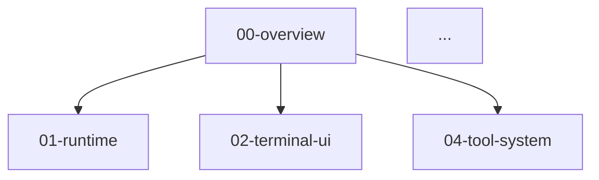

# Claude Code Deep Dive 仓库设计方案

> **项目目标**
>
> 创建一个系统化的技术文档项目，深度解析 Claude Code CLI 的架构设计、技术选型和实现细节。
>
> **设计原则:** 混合模式、细粒度章节、精简代码、纯理论分析、多维导航

---

## 目录

- [1. 项目概述](#1-项目概述)
- [2. 目标读者与定位](#2-目标读者与定位)
- [3. 仓库架构设计](#3-仓库架构设计)
- [4. 章节规划](#4-章节规划)
- [5. 写作规范](#5-写作规范)
- [6. 实施计划](#6-实施计划)
- [7. 质量保证](#7-质量保证)
- [8. 维护策略](#8-维护策略)

---

## 1. 项目概述

### 1.1 背景

Claude Code CLI 是 Anthropic 推出的 AI 辅助编程工具，包含约 1,900 个文件、512,000+ 行 TypeScript 代码。其架构设计体现了大型 AI Agent 系统的工程实践，具有很高的学习价值。

### 1.2 项目目标

**核心目标：**
- 系统化解析 Claude Code 的架构设计
- 帮助开发者理解 AI Agent CLI 工具的实现
- 提供清晰的学习路径和多维导航

**非目标：**
- ❌ 不是使用教程（官方文档已覆盖）
- ❌ 不是扩展开发指南（专注理论分析）
- ❌ 不是代码审查或优化建议

### 1.3 设计原则

1. **混合模式** - 先总览建立全局认知，然后按主题深入细节
2. **细粒度章节** - 每个子系统独立成章（3,000-5,000字）
3. **精简代码** - 保留核心逻辑，去掉实现细节
4. **纯理论分析** - 专注"是什么"和"为什么"，而非"怎么做"
5. **多维导航** - 支持按层次、功能、难度多种阅读路径

---

## 2. 目标读者与定位

### 2.1 主要读者

**目标读者：** 想要深入理解 Claude Code 架构的开发者

**读者画像：**
- 有一定工程经验（3年+）
- 熟悉 TypeScript/JavaScript
- 对 AI Agent 系统设计感兴趣
- 希望学习大型 CLI 工具的架构实践

### 2.2 阅读场景

**典型使用场景：**
1. **系统学习** - 按推荐路径完整阅读
2. **按需查阅** - 根据兴趣点跳跃阅读
3. **架构研究** - 对比不同子系统的设计思路
4. **技术参考** - 在自己的项目中应用相似模式

### 2.3 预期收获

读者完成阅读后应能够：
- 理解 Claude Code 的整体架构和设计思路
- 掌握 AI Agent 系统的核心技术挑战
- 了解终端 UI、状态管理、任务编排等关键技术
- 获得大型 TypeScript 项目的架构灵感

---

## 3. 仓库架构设计

### 3.1 整体结构

```
claude-code-deep-dive/
├── README.md                           # 主入口：项目介绍 + 快速导航
│
├── chapters/                           # 核心章节目录（20+ 章）
│   ├── 00-overview.md                 # 总览：架构全景图
│   ├── 01-runtime-foundation.md       # Bun 运行时基础
│   ├── 02-terminal-ui.md              # Ink 终端 UI 系统
│   ├── 03-type-system.md              # TypeScript 类型系统设计
│   ├── 04-tool-system.md              # Tool 工具系统架构
│   ├── 05-command-system.md           # Command 命令系统
│   ├── 06-query-engine.md             # QueryEngine 查询引擎核心
│   ├── 07-state-management.md         # 状态管理（AppState + Zustand）
│   ├── 08-task-framework.md           # 任务生命周期管理（Harness）
│   ├── 09-session-storage.md          # 会话持久化（JSONL）
│   ├── 10-cron-scheduler.md           # 定时任务调度
│   ├── 11-agent-coordination.md       # 多 Agent 协调与通信
│   ├── 12-permission-system.md        # 工具权限管理
│   ├── 13-mcp-integration.md          # MCP 协议集成
│   ├── 14-bridge-system.md            # IDE Bridge 架构
│   ├── 15-plugin-system.md            # 插件架构
│   ├── 16-skill-system.md             # Skill 技能系统
│   ├── 17-vim-mode.md                 # Vim 模式实现
│   ├── 18-graceful-shutdown.md        # 优雅关闭机制
│   ├── 19-feature-flags.md            # 特性开关（Bun:bundle）
│   └── 20-remote-execution.md         # 远程会话与执行
│
├── guides/                             # 多维导航索引
│   ├── README.md                      # 索引说明
│   ├── by-layer.md                    # 按架构层次导航
│   ├── by-feature.md                  # 按功能特性导航
│   ├── by-difficulty.md               # 按学习难度导航
│   └── dependency-graph.md            # 章节依赖关系图
│
├── assets/                             # 静态资源
│   ├── diagrams/                      # 架构图、流程图（Mermaid/SVG）
│   │   ├── architecture-overview.svg
│   │   ├── tool-system-flow.svg
│   │   └── ...
│   └── code-locations.md              # 源码位置索引
│
├── glossary.md                         # 术语表
└── CONTRIBUTING.md                     # 贡献指南
```

### 3.2 设计理念

**为什么选择平铺章节 + 多维索引？**

| 方案 | 优点 | 缺点 | 决策 |
|------|------|------|------|
| 嵌套目录 | 体现层次关系 | 目录深、跨层引用困难 | ❌ |
| 按时间线 | 符合学习顺序 | 单一路径、不灵活 | ❌ |
| **平铺 + 索引** | **独立性强、多路径、易维护** | **需维护索引** | ✅ |

**核心优势：**
- ✅ 章节完全独立，便于更新和维护
- ✅ 支持多种阅读路径（层次、功能、难度）
- ✅ 新增章节不影响现有结构
- ✅ 索引文件本身展示系统关联

---

## 4. 章节规划

### 4.1 完整章节列表

| 序号 | 章节名 | 主题 | 难度 | 字数 | 依赖章节 |
|-----|--------|------|------|------|---------|
| 00 | overview | 架构总览 | ⭐ 入门 | ~3,500 | - |
| 01 | runtime-foundation | Bun 运行时 | ⭐⭐ 进阶 | ~4,000 | 00 |
| 02 | terminal-ui | Ink UI 系统 | ⭐⭐ 进阶 | ~4,000 | 00 |
| 03 | type-system | TS 类型设计 | ⭐⭐⭐ 高级 | ~4,500 | 00 |
| 04 | tool-system | Tool 架构 | ⭐⭐ 进阶 | ~4,000 | 00,03 |
| 05 | command-system | Command 架构 | ⭐⭐ 进阶 | ~3,500 | 00 |
| 06 | query-engine | 查询引擎 | ⭐⭐⭐ 高级 | ~5,000 | 00,04 |
| 07 | state-management | 状态管理 | ⭐⭐ 进阶 | ~4,000 | 00 |
| 08 | task-framework | 任务框架 | ⭐⭐⭐ 高级 | ~4,000 | 07,09 |
| 09 | session-storage | 会话持久化 | ⭐⭐ 进阶 | ~3,500 | 00 |
| 10 | cron-scheduler | 定时调度 | ⭐⭐⭐ 高级 | ~3,500 | 08,09 |
| 11 | agent-coordination | Agent 协调 | ⭐⭐⭐ 高级 | ~4,500 | 04,06,08 |
| 12 | permission-system | 权限管理 | ⭐⭐ 进阶 | ~3,500 | 04,07 |
| 13 | mcp-integration | MCP 集成 | ⭐⭐⭐ 高级 | ~4,000 | 04 |
| 14 | bridge-system | IDE Bridge | ⭐⭐⭐ 高级 | ~4,500 | 06,07 |
| 15 | plugin-system | 插件架构 | ⭐⭐ 进阶 | ~3,500 | 04 |
| 16 | skill-system | Skill 系统 | ⭐⭐ 进阶 | ~3,500 | 04,06 |
| 17 | vim-mode | Vim 模式 | ⭐⭐ 进阶 | ~3,500 | 02 |
| 18 | graceful-shutdown | 优雅关闭 | ⭐⭐⭐ 高级 | ~3,500 | 07,08 |
| 19 | feature-flags | 特性开关 | ⭐ 入门 | ~3,000 | 01 |
| 20 | remote-execution | 远程执行 | ⭐⭐⭐ 高级 | ~4,500 | 06,08,14 |

**总计：** 21 章，约 80,000 字

### 4.2 章节分组（按架构层次）

**Layer 0: 基础设施层**
- 01-runtime-foundation.md - Bun 运行时
- 02-terminal-ui.md - Ink UI 系统
- 03-type-system.md - TypeScript 类型系统

**Layer 1: 执行层**
- 04-tool-system.md - Tool 工具系统
- 05-command-system.md - Command 命令系统
- 12-permission-system.md - 权限管理

**Layer 2: 编排层**
- 06-query-engine.md - 查询引擎
- 08-task-framework.md - 任务框架
- 11-agent-coordination.md - Agent 协调

**Layer 3: 持久化层**
- 07-state-management.md - 状态管理
- 09-session-storage.md - 会话存储
- 10-cron-scheduler.md - 定时调度

**Layer 4: 扩展层**
- 13-mcp-integration.md - MCP 集成
- 14-bridge-system.md - IDE Bridge
- 15-plugin-system.md - 插件架构
- 16-skill-system.md - Skill 系统

**Layer 5: 特性层**
- 17-vim-mode.md - Vim 模式
- 18-graceful-shutdown.md - 优雅关闭
- 19-feature-flags.md - 特性开关
- 20-remote-execution.md - 远程执行

### 4.3 多维导航设计

**guides/by-layer.md** - 按架构层次
```markdown
# 按架构层次学习

从底层基础设施到上层特性功能，逐层理解系统。

## Layer 0: 基础设施层
构建系统的基石 - 运行时、UI 框架、类型系统

1. [01-runtime-foundation](../chapters/01-runtime-foundation.md)
2. [02-terminal-ui](../chapters/02-terminal-ui.md)
3. [03-type-system](../chapters/03-type-system.md)

## Layer 1: 执行层
...
```

**guides/by-feature.md** - 按功能特性
```markdown
# 按功能特性导航

根据关心的功能特性，快速找到相关章节。

## 📁 文件操作
**我想了解 Claude 如何读写文件**
- [04-tool-system](../chapters/04-tool-system.md)
  - Read Tool、Write Tool、Edit Tool

## 🔍 代码搜索
**我想了解 Claude 如何搜索代码**
- [04-tool-system](../chapters/04-tool-system.md)
  - GrepTool（ripgrep）、GlobTool

...
```

**guides/by-difficulty.md** - 按学习难度
```markdown
# 按难度循序渐进

## ⭐ 入门级（建立全局认知）
1. [00-overview](../chapters/00-overview.md) - 先看这个！
2. [19-feature-flags](../chapters/19-feature-flags.md)

## ⭐⭐ 进阶级（理解核心机制）
3-12. [列出进阶章节]

## ⭐⭐⭐ 高级（深入复杂系统）
13-20. [列出高级章节]
```

**guides/dependency-graph.md** - 章节依赖关系


---

## 5. 写作规范

### 5.1 统一章节模板

每个章节遵循以下结构（3,000-5,000 字）：

```markdown
# [章节号] [章节标题]

> **摘要**
>
> 一段话概括本章内容（100字以内）
>
> **关键概念:** 列出3-5个核心概念
>
> **前置知识:** 需要先阅读的章节链接
>
> **源码位置:** `src/xxx/xxx.ts`

---

## 目录

- [1. 概述](#1-概述)
- [2. 设计目标与约束](#2-设计目标与约束)
- [3. 核心架构](#3-核心架构)
- [4. 关键实现](#4-关键实现)
- [5. 设计权衡](#5-设计权衡)
- [6. 与其他系统的关联](#6-与其他系统的关联)
- [7. 总结](#7-总结)

---

## 1. 概述

### 1.1 这是什么？
用200-300字解释这个系统/模块的本质

### 1.2 为什么需要它？
解决什么问题？如果没有它会怎样？

### 1.3 在整体架构中的位置
用简单的ASCII图或Mermaid图展示位置关系

---

## 2. 设计目标与约束

### 2.1 设计目标
- 目标1：xxx
- 目标2：xxx

### 2.2 技术约束
- 约束1：xxx
- 约束2：xxx

### 2.3 非目标
明确说明这个系统**不做**什么

---

## 3. 核心架构

### 3.1 整体设计
用架构图展示主要组件和关系

### 3.2 核心概念
定义和解释核心概念（用精简代码示例）

```typescript
// 核心类型定义（精简版）
interface CoreConcept {
  // 只保留核心字段
}
```

### 3.3 数据流
用序列图或流程图展示关键流程

---

## 4. 关键实现

### 4.1 实现细节1
用精简代码展示核心逻辑

```typescript
// 伪代码：突出设计思想
function coreLogic() {
  // 步骤1：xxx
  // 步骤2：xxx
}
```

### 4.2 实现细节2
...

---

## 5. 设计权衡

### 5.1 为什么选择这种设计？
解释设计决策的理由

### 5.2 有哪些替代方案？
| 方案 | 优点 | 缺点 | 为何不选 |
|------|------|------|----------|
| 方案A | xxx | xxx | xxx |
| **当前方案** | **xxx** | **xxx** | **已选择** |

### 5.3 存在的局限性
坦诚说明当前设计的不足之处

---

## 6. 与其他系统的关联

### 6.1 依赖的系统
- [xx-system](./xx-system.md): 如何使用它

### 6.2 被依赖的系统
- [zz-system](./zz-system.md): 如何被使用

### 6.3 协作关系
描述与相关系统的交互模式

---

## 7. 总结

### 7.1 核心要点回顾
- 要点1
- 要点2

### 7.2 进一步阅读
推荐相关章节

---

**章节信息**
- **字数:** ~4,000
- **难度:** ⭐⭐ 进阶
- **最后更新:** YYYY-MM-DD
```

### 5.2 写作风格指南

**语言风格：**
- ✅ 使用主动语态："系统通过 X 实现 Y"
- ✅ 保持技术准确性，避免模糊词汇
- ✅ 用类比帮助理解复杂概念
- ❌ 避免"显然"、"简单"等主观词
- ❌ 避免口语化表达

**代码示例原则：**
```typescript
// ✅ 好的示例：精简、突出设计意图
interface Task {
  id: string
  status: 'pending' | 'running' | 'completed'
  execute(): Promise<void>
}

// ❌ 不好的示例：包含无关细节
interface Task {
  id: string
  status: TaskStatus
  metadata: Record<string, any>
  timestamps: { created: number; updated: number }
  execute(context: ExecutionContext): Promise<TaskResult>
  // ... 还有很多字段
}
```

**图表使用：**
- **架构图：** Mermaid 或 ASCII Art
- **流程图：** Mermaid Sequence Diagram
- **数据结构：** 代码块 + 注释

**术语处理：**
- 首次出现：加粗并解释 - **Agent**（代理）是指...
- 后续出现：直接使用
- 统一术语：在 glossary.md 中维护

### 5.3 代码示例标准

**精简原则：**
1. 只保留核心逻辑
2. 去掉错误处理、日志、验证等辅助代码
3. 用注释说明省略的部分
4. 使用伪代码语法突出设计意图

**示例对比：**

```typescript
// ❌ 完整源码（不推荐）
export async function executeBackgroundBash(
  command: string,
  options: BashOptions,
  context: ToolUseContext
): Promise<ToolResult> {
  const taskId = randomUUID()
  const outputPath = getTaskOutputPath(taskId)

  if (!options.dangerouslyDisableSandbox && isSandboxEnabled()) {
    throw new Error('Sandbox mode required')
  }

  const task: LocalShellTaskState = {
    id: taskId,
    type: 'local_shell',
    status: 'running',
    // ... 10+ 个字段
  }

  try {
    registerTask(task, context.setAppState)
    // ... 50+ 行实现
  } catch (error) {
    // ... 错误处理
  }
}

// ✅ 精简版（推荐）
async function executeBackgroundBash(command: string) {
  // 1. 创建任务
  const task = {
    id: randomUUID(),
    status: 'running',
    outputPath: getTaskOutputPath()
  }

  // 2. 注册到状态
  registerTask(task)

  // 3. 启动子进程
  const child = spawn('bash', ['-c', command])

  // 4. 重定向输出到文件
  child.stdout.pipe(createWriteStream(task.outputPath))

  // 5. 监听退出事件
  child.on('exit', code => {
    updateTaskStatus(task.id, code === 0 ? 'completed' : 'failed')
  })
}
```

---

## 6. 实施计划

### 6.1 创建阶段与优先级

**Phase 0: 基础设施搭建（1-2天）**
```
任务：
✓ 创建 GitHub 仓库
✓ 初始化目录结构
✓ 编写 README.md 和 CONTRIBUTING.md
✓ 配置 Git、编辑器
✓ 创建章节模板文件（占位符）

产出：
- 空的仓库框架
- 所有章节占位文件
- 基础文档
```

**Phase 1: 核心内容创作（2-3周）**

**优先级 P0（必须完成，建立骨架）：**
1. ✅ `00-overview.md` - 总览
2. ⏳ `04-tool-system.md` - Tool 系统
3. ⏳ `06-query-engine.md` - Query Engine
4. ⏳ `07-state-management.md` - 状态管理
5. ⏳ `08-task-framework.md` - 任务框架

**优先级 P1（重要，扩充核心理解）：**
6-10. [列出 5 个章节]

**优先级 P2（补充细节）：**
11-15. [列出 5 个章节]

**优先级 P3（高级专题）：**
16-21. [列出 6 个章节]

**Phase 2: 导航与索引（3-5天）**
```
任务：
- 编写 guides/by-layer.md
- 编写 guides/by-feature.md
- 编写 guides/by-difficulty.md
- 创建 guides/dependency-graph.md
- 编写 glossary.md

产出：
- 完整的多维导航体系
- 术语表
```

**Phase 3: 图表与优化（1周）**
```
任务：
- 为每章创建架构图（Mermaid）
- 统一代码示例风格
- 检查章节间交叉引用
- 优化阅读体验

产出：
- 20+ 架构图
- 统一的视觉风格
```

**Phase 4: 审校与发布（3-5天）**
```
任务：
- 全文通读审校
- 修正错误和不一致
- 补充缺失的交叉引用
- 发布第一个版本 v1.0

产出：
- 完整可用的文档集
```

### 6.2 单章创作流程

**标准工作流（4-6小时/章）：**

```
Step 1: 源码阅读（1-2小时）
├─ 定位相关源文件（src/xxx/）
├─ 通读核心代码
├─ 记录关键类型定义
└─ 标记疑问点

Step 2: 架构提取（1小时）
├─ 绘制架构图（Mermaid 草稿）
├─ 整理核心概念
├─ 梳理数据流
└─ 识别设计模式

Step 3: 写作（2-3小时）
├─ 按模板填充各节
├─ 编写精简代码示例
├─ 添加图表
└─ 标注交叉引用

Step 4: 审校（30分钟）
├─ 检查术语一致性
├─ 验证代码示例正确性
├─ 测试所有链接
└─ 字数检查（3000-5000字）
```

**推荐工具：**
- **编辑器：** VSCode + Markdown Preview Enhanced
- **图表：** Mermaid Live Editor (https://mermaid.live)
- **源码导航：** 当前的 Claude Code CLI 源码仓库
- **版本控制：** Git + GitHub

### 6.3 时间估算

**保守估算（兼职创作）：**

| 阶段 | 工作量 | 时间跨度 |
|------|--------|----------|
| Phase 0 | 4-6 小时 | 1-2 天 |
| Phase 1 (P0) | 5章 × 5小时 = 25小时 | 1-1.5 周 |
| Phase 1 (P1) | 5章 × 5小时 = 25小时 | 1-1.5 周 |
| Phase 1 (P2) | 5章 × 5小时 = 25小时 | 1-1.5 周 |
| Phase 1 (P3) | 6章 × 6小时 = 36小时 | 2 周 |
| Phase 2 | 20 小时 | 3-5 天 |
| Phase 3 | 30 小时 | 1 周 |
| Phase 4 | 15 小时 | 3-5 天 |
| **总计** | **180小时** | **8-10周** |

**激进估算（全职创作）：**
- 每天 8 小时投入
- **3-4 周**完成全部内容

### 6.4 里程碑

**里程碑计划：**

```
M1 (2周): 核心骨架
- 完成 P0 的 5 章
- 建立基础导航
- 发布 v0.1（Early Preview）

M2 (4周): 可用版本
- 完成 P0 + P1 的 10 章
- 完善导航索引
- 发布 v0.5（Beta）

M3 (7周): 完整版本
- 完成 P0-P2 的 15 章
- 所有图表完善
- 发布 v0.9（RC）

M4 (10周): 正式发布
- 完成全部 20+ 章
- 审校与优化
- 发布 v1.0（Stable）
```

---

## 7. 质量保证

### 7.1 自检清单

**每章完成后的检查项：**

```markdown
## 内容完整性
- [ ] 7个标准章节都已填充
- [ ] 摘要准确概括（<100字）
- [ ] 关键概念列举完整（3-5个）
- [ ] 源码位置标注准确

## 技术准确性
- [ ] 代码示例可运行（或明确标注伪代码）
- [ ] 术语使用与 glossary.md 一致
- [ ] 技术细节经过源码验证
- [ ] 避免主观臆测

## 可读性
- [ ] 逻辑连贯，前后呼应
- [ ] 避免术语堆砌
- [ ] 图表清晰易懂
- [ ] 代码示例有注释

## 格式规范
- [ ] Markdown 语法正确
- [ ] 链接全部有效
- [ ] 字数在 3000-5000 之间
- [ ] 遵循章节模板结构

## 导航性
- [ ] 标注了前置章节
- [ ] 标注了后续推荐章节
- [ ] 难度标签准确
- [ ] 在索引文件中更新
```

### 7.2 同行评审（可选）

- 邀请其他开发者阅读 1-2 个章节
- 收集反馈：哪里不清楚？哪里太详细？
- 迭代改进

---

## 8. 维护策略

### 8.1 版本管理

```
v1.0 - 首次发布（20章完整）
v1.1 - 补充细节、修正错误
v1.2 - 根据社区反馈更新
v2.0 - 源码更新后的大版本迭代
```

### 8.2 更新触发条件

1. **源码变化** - Claude Code 有重大更新
2. **错误发现** - Issue 报告的技术错误
3. **补充需求** - 社区请求新增章节

### 8.3 可持续性

- 每章独立，便于单独更新
- 源码位置标注，便于追踪变化
- Git 历史记录所有演进

### 8.4 迁移现有内容

已有的 `Claude_Code_Harness_Engineering.md`（11,000字）需要拆分改造：

**改造方案：**
```
原文档（11,000字，深度专题）
    ↓ 拆分为 4 个章节
08-task-framework.md（4,000字，核心）
09-session-storage.md（3,000字，持久化）
10-cron-scheduler.md（3,500字，调度）
18-graceful-shutdown.md（3,000字，关闭）
```

**改造步骤：**
1. 识别原文档的 4 个主题边界
2. 按主题切分内容
3. 每个切片按新模板重组
4. 补充"设计权衡"和"关联系统"章节
5. 调整代码示例为精简版

**优势：**
- ✅ 复用 80% 现有内容
- ✅ 符合新的章节规范
- ✅ 独立性更强，便于阅读

---

## 总结

### 预期产出

**文档规模：**
- 21 个章节，约 80,000 字
- 30+ 架构图（Mermaid）
- 100+ 精简代码示例
- 完整的多维索引体系

**核心特点：**
1. ✅ **混合模式** - 总览 + 主题深入
2. ✅ **细粒度章节** - 3000-5000字/章，独立阅读
3. ✅ **精简代码** - 保留核心逻辑，去掉细节
4. ✅ **纯理论分析** - 专注"是什么"和"为什么"
5. ✅ **多维导航** - 按层次/功能/难度多种路径

**时间投入：**
- 保守：8-10 周（兼职）
- 激进：3-4 周（全职）

**价值主张：**
- 帮助开发者系统化理解 Claude Code 架构
- 提供 AI Agent CLI 工具的架构参考
- 展示大型 TypeScript 项目的工程实践

---

**设计文档版本:** 1.0
**创建日期:** 2026-03-31
**作者:** Claude + 用户协作
